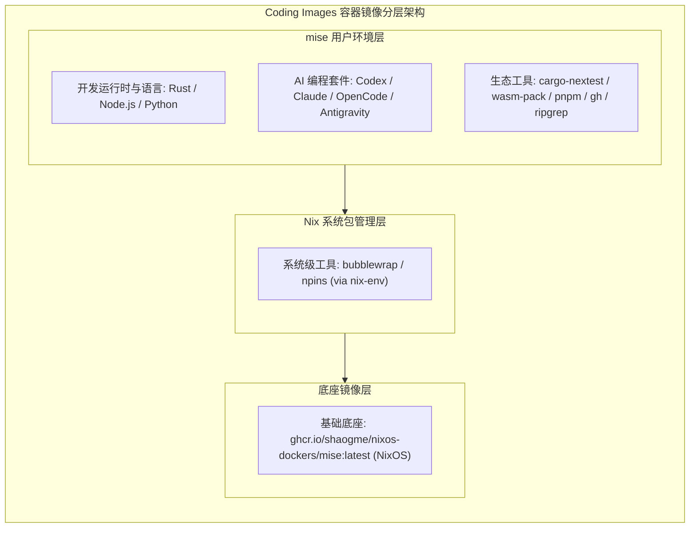
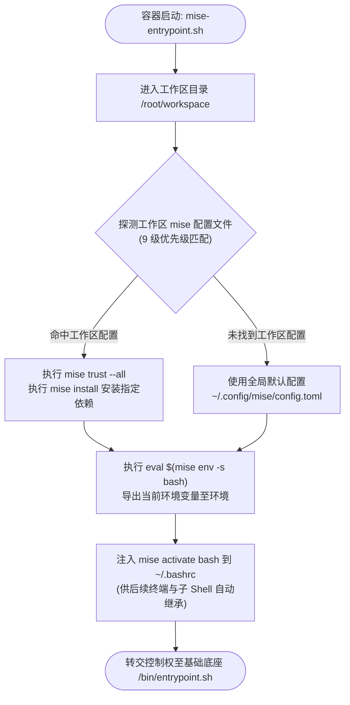
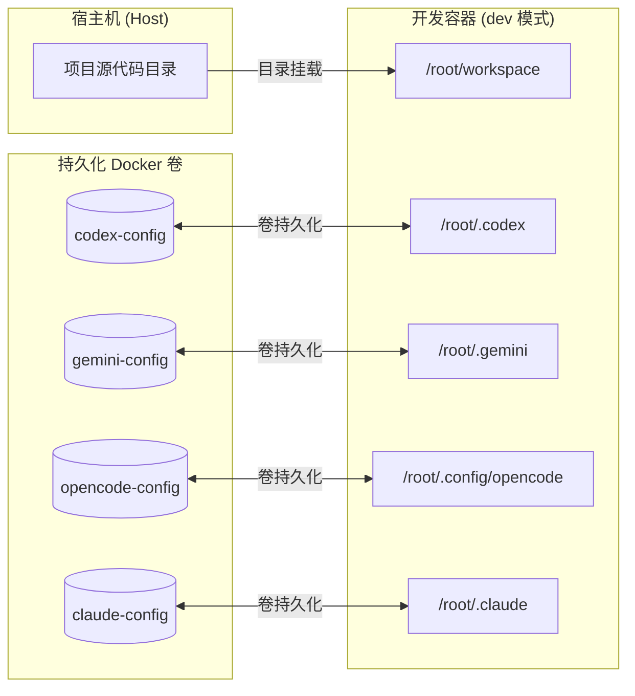
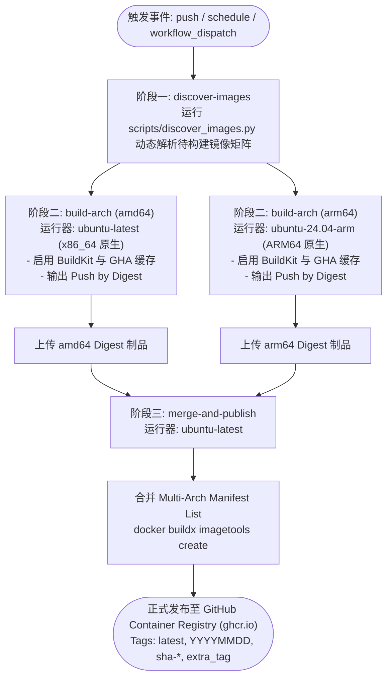

# Coding Images

Coding Images 是一个面向现代化云原生与本地开发的容器镜像仓库。所有镜像均基于 NixOS 与 mise 版本管理器构建，原生支持 `linux/amd64` 与 `linux/arm64` 双架构，集成了主流 AI 编程助手 CLI（OpenAI Codex、Claude Code、OpenCode、Antigravity CLI）以及现代语言与工具链，旨在为开发者提供开箱即用、环境一致且易于扩展的编程工作区。

---

## 目录

- [核心特性](#核心特性)
- [镜像列表与环境清单](#镜像列表与环境清单)
  - [1. npins-common](#1-npins-common)
  - [2. rust-common](#2-rust-common)
  - [3. rust-wasm](#3-rust-wasm)
- [镜像架构与设计机制](#镜像架构与设计机制)
  - [基础镜像与包管理](#基础镜像与包管理)
  - [智能 Entrypoint 引导流程](#智能-entrypoint-引导流程)
  - [容器开发模式与配置持久化](#容器开发模式与配置持久化)
- [快速开始](#快速开始)
  - [使用 Docker 直接运行](#使用-docker-直接运行)
  - [使用 Docker Compose 进行开发](#使用-docker-compose-进行开发)
- [本地开发与镜像扩展](#本地开发与镜像扩展)
  - [镜像目录规范](#镜像目录规范)
  - [镜像自动发现脚本](#镜像自动发现脚本)
  - [本地构建镜像](#本地构建镜像)
- [CI/CD 自动化构建与发布](#cicd-自动化构建与发布)
  - [多架构原生构建流水线](#多架构原生构建流水线)
  - [镜像标签管理策略](#镜像标签管理策略)
  - [工作流触发方式](#工作流触发方式)
- [项目目录结构](#项目目录结构)

---

## 核心特性

- **多架构原生构建**：通过 GitHub Actions 分别在 x86_64（`ubuntu-latest`）和 ARM64（`ubuntu-24.04-arm`）运行器上原生编译打包，避免 QEMU 模拟器的性能开销，生成统一的 Multi-Arch 镜像清单。
- **声明式环境管理**：底层借助 NixOS 基础镜像提供干净可靠的系统级依赖，用户空间通过 `mise` 统一管理 Node.js、Python、Rust、WebAssembly 及各类 CLI 工具。
- **内置 AI 编程套件**：预装主流终端 AI 编码工具（`@openai/codex`、`claude-code`、`opencode`、`antigravity-cli`），并提供统一的数据卷挂载配置以持久化登录凭证和会话上下文。
- **智能工作区配置加载**：容器启动脚本自动探测工作区内 9 种常见层级的 mise 配置文件。如果检测到项目专用配置，将自动执行信任与依赖安装，实现环境按需热加载。
- **完备的构建缓存优化**：Dockerfile 深度集成 BuildKit 缓存挂载（针对 Nix 缓存、mise 工具缓存、Cargo 依赖缓存等），显著加快构建与更新速度。

---

## 镜像列表与环境清单

所有镜像均发布至 GitHub Container Registry（GHCR）：
`ghcr.io/<owner>/coding-images/<image-name>:<tag>`

### 1. npins-common

针对基于 Nix 与 npins 进行依赖锁定的通用轻量开发环境。

- **镜像地址**：`ghcr.io/shaogme/coding-images/npins-common:latest`
- **基础镜像**：`ghcr.io/shaogme/nixos-dockers/mise:latest`
- **系统包（Nix）**：
  - `bubblewrap`（沙箱隔离支持）
  - `npins`（Nix 依赖通道与仓库钉扎工具）
- **开发语言与运行时（mise）**：
  - Python: `latest`
  - Node.js: `latest`（作为 Codex 依赖间接引入）
- **AI 辅助工具**：
  - OpenAI Codex CLI (`@openai/codex`)
  - Claude Code (`anthropics/claude-code`)
  - OpenCode (`anomalyco/opencode`)
  - Google Antigravity CLI (`google-antigravity/antigravity-cli`)
- **通用工具**：
  - `jq`、`ripgrep`、`gh`（GitHub CLI）

### 2. rust-common

专为 Rust 核心开发打造的完整环境，集成稳定版与每日构建版编译器及前端全栈辅助工具链。

- **镜像地址**：`ghcr.io/shaogme/coding-images/rust-common:latest`
- **基础镜像**：`ghcr.io/shaogme/nixos-dockers/mise:latest`
- **系统包（Nix）**：
  - `bubblewrap`
- **开发语言与运行时（mise）**：
  - Rust: `stable`（包含 `rust-src` 源码组件）
  - Rust: `nightly`（包含 `rust-src` 源码组件）
  - Node.js: `latest`
  - pnpm: `latest`
  - yarn: `latest`
  - Python: `latest`
- **Rust 专属扩展工具**：
  - `cargo-nextest`（新一代下一代 Rust 测试运行器）
  - `cargo-binstall`（二进制快速安装工具）
- **AI 辅助工具**：
  - `@openai/codex`、`claude-code`、`opencode`、`antigravity-cli`
- **通用工具**：
  - `jq`、`ripgrep`、`gh`

### 3. rust-wasm

在 `rust-common` 基础上扩展的 WebAssembly 专属开发环境，适用于 Rust WASM 库、前端组件及 WASI 应用开发。

- **镜像地址**：`ghcr.io/shaogme/coding-images/rust-wasm:latest`
- **基础镜像**：`ghcr.io/shaogme/nixos-dockers/mise:latest`
- **包含 rust-common 的所有工具**，并额外增加：
- **Rust 交叉编译 Target**：
  - `wasm32-unknown-unknown`（针对 `stable` 和 `nightly` 均已安装）
- **WebAssembly 专属工具链**：
  - `wasm-pack`（Rust WASM 构建与打包分发工具）
  - `wasm-bindgen-cli`（JS/Rust 绑定代码生成器）
  - `wasmi_cli`（Wasm 解释执行器 CLI）

---

## 镜像架构与设计机制

### 基础镜像与包管理



1. **底层操作系统**：采用 NixOS 容器底座，具备隔离度高、系统依赖干净等优点。
2. **两级包管理模型**：
   - 基础系统工具通过 `nix-env` 声明安装。
   - 开发者工具链、编程语言及 AI 命令行全部由 `mise` 统一调度安装与版本锁定，避免传统 Linux 发行版包版本陈旧或互相冲突的问题。

### 智能 Entrypoint 引导流程

每个镜像均配备了定制的容器入口脚本 `docker/entrypoint.sh`（安装至 `/usr/local/bin/mise-entrypoint.sh`）：



1. **环境侦测**：进入工作区目录（默认为 `/root/workspace`），按照以下优先级自动探测项目专属的 mise 配置文件：
   - `mise.${MISE_ENV}.local.toml` / `.mise.${MISE_ENV}.local.toml`
   - `mise.local.toml` / `.mise.local.toml` / `mise.*.local.toml`
   - `mise.${MISE_ENV}.toml` / `.mise.${MISE_ENV}.toml`
   - `mise.toml` / `.mise.toml` / `mise.*.toml`
   - `mise/config.toml` / `mise/conf.d/*.toml`
   - `.mise/config.toml` / `.mise/conf.d/*.toml`
   - `.config/mise.toml` / `.config/mise/config.toml` / `.config/mise/conf.d/*.toml`
2. **自动信任与安装**：如果发现工作区配置文件，自动执行 `mise trust --all` 与 `mise install` 安装项目所需的特定版本工具；若未发现，则沿用镜像内置的全局配置（`/root/.config/mise/config.toml`）。
3. **环境变量导出**：执行 `eval "$(mise env -s bash)"`，使启动命令及子进程立刻获得正确的 `PATH` 及环境变量。
4. **Shell 会话集成**：将 `eval "$(mise activate bash)"` 写入 `/root/.bashrc`，确保后续通过 `docker exec` 或 VS Code 终端打开的 Bash 会话自动生效。
5. **底座接管**：最终将控制流交由底层 NixOS 镜像的 `/bin/entrypoint.sh` 启动系统服务或前台进程。

### 容器开发模式与配置持久化

各镜像预置了主流 AI 编程助手，通过 Docker Compose 的命名卷实现本地凭证与配置持久化，容器重启或重新构建后无需重复认证：



- `/root/.codex` -> `codex-config`（OpenAI Codex 配置与认证）
- `/root/.gemini` -> `gemini-config`（Google Gemini 相关配置）
- `/root/.config/opencode` -> `opencode-config`（OpenCode 配置文件）
- `/root/.claude` -> `claude-config`（Claude Code 登录状态与项目记忆）

---

## 快速开始

### 使用 Docker 直接运行

以 `rust-wasm` 镜像为例，启动一个交互式容器：

```bash
docker run -it --rm \
  -v $(pwd):/root/workspace \
  -v claude-config:/root/.claude \
  -v codex-config:/root/.codex \
  --cap-add=SYS_ADMIN \
  --cap-add=SYS_PTRACE \
  ghcr.io/shaogme/coding-images/rust-wasm:latest bash
```

### 使用 Docker Compose 进行开发

每个镜像目录下均提供了标准的 `docker-compose.yml` 模版，支持两种运行模式：

#### 1. 开发挂载模式（dev，默认）

挂载当前宿主机目录到容器内部 `/root/workspace`，支持代码实时修改与持久化：

```bash
cd images/rust/wasm
docker compose up -d dev
docker compose exec dev bash
```

#### 2. 独立运行模式（standalone）

直接使用镜像内部预置的代码目录，不挂载宿主机工作区：

```bash
cd images/rust/wasm
docker compose --profile standalone up -d standalone
docker compose exec standalone bash
```

#### 配置说明（docker-compose.yml 示例）

```yaml
services:
  app-base: &app-base
    image: ghcr.io/shaogme/coding-images/rust-wasm:latest
    environment:
      - ROOT_PASSWORD=root
      - MISE_YES=1
    security_opt:
      - seccomp:unconfined
    cap_add:
      - SYS_ADMIN
      - SYS_PTRACE
      - NET_ADMIN
    tty: true

  dev:
    <<: *app-base
    container_name: rust-wasm-dev
    volumes:
      - .:/root/workspace
      - codex-config:/root/.codex
      - gemini-config:/root/.gemini
      - opencode-config:/root/.config/opencode
      - claude-config:/root/.claude

  standalone:
    <<: *app-base
    container_name: rust-wasm-standalone
    volumes:
      - codex-config:/root/.codex
      - gemini-config:/root/.gemini
      - opencode-config:/root/.config/opencode
      - claude-config:/root/.claude
    profiles:
      - standalone

volumes:
  mise-cache:
  codex-config:
  gemini-config:
  opencode-config:
  claude-config:
```

---

## 本地开发与镜像扩展

### 镜像目录规范

所有镜像均存放在 `images/` 目录下，支持按分类划分子目录。例如：
`images/<category>/<image-name>/`

每个镜像目录的标准结构如下：

```
images/rust/wasm/
├── .config/
│   └── mise.toml         # 该镜像预装的全局 mise 工具清单
├── docker/
│   ├── Dockerfile        # 镜像构建定义
│   └── entrypoint.sh     # 镜像入口引导脚本
└── docker-compose.yml    # 本地容器编排配置
```

*注意：`Dockerfile` 可以位于 `<context>/docker/Dockerfile`，也可以直接位于 `<context>/Dockerfile`。自动发现脚本均能正确识别。*

### 镜像自动发现脚本

仓库内置了 Python 脚本 `scripts/discover_images.py`，用于动态遍历并输出待构建镜像的信息：

```bash
# 查看帮助
python3 scripts/discover_images.py --help

# 以 GitHub Actions 矩阵格式输出全部镜像
python3 scripts/discover_images.py --format matrix

# 以易读 JSON 格式输出
python3 scripts/discover_images.py --format json

# 仅输出所有镜像名称
python3 scripts/discover_images.py --format names

# 筛选特定镜像（如 rust-wasm）
python3 scripts/discover_images.py --target rust-wasm --format json
```

### 本地构建镜像

在项目根目录下，使用 Docker BuildKit 构建特定镜像：

```bash
# 启用 BuildKit
export DOCKER_BUILDKIT=1

# 构建 rust-common 镜像
docker build \
  -t coding-images/rust-common:local \
  -f images/rust/common/docker/Dockerfile \
  images/rust/common

# 构建 rust-wasm 镜像
docker build \
  -t coding-images/rust-wasm:local \
  -f images/rust/wasm/docker/Dockerfile \
  images/rust/wasm
```

---

## CI/CD 自动化构建与发布

本项目通过 GitHub Actions 实现了完全自动化、多架构原生的镜像构建与发布流程。

### 多架构原生构建流水线



1. **阶段一：镜像探测（discover-images）**
   - 执行 `scripts/discover_images.py` 分析 `images/` 目录，生成动态作业矩阵。
2. **阶段二：原生矩阵构建（build-arch）**
   - `linux/amd64`：在 GitHub 官方 `ubuntu-latest` 运行器上原生构建。
   - `linux/arm64`：在 GitHub 官方 `ubuntu-24.04-arm` 运行器上原生构建。
   - 每个架构构建完成后，以专属 Digest 形式推送临时层到 GHCR，并将 Digest 上传为工作流制品。
3. **阶段三：清单合并与发布（merge-and-publish）**
   - 汇集双架构 Digest。
   - 使用 `docker buildx imagetools create` 命令组合生成 Multi-Arch Manifest List。
   - 一次性打上对应标签并正式推送到 GHCR。

### 镜像标签管理策略

每次自动化发布将应用以下标签：

- `latest`：指向最新的主分支镜像构建。
- `<YYYYMMDD>`：按构建日期打标（例如 `20260828`），方便环境版本回溯。
- `sha-<commit_sha>`：关联特定的 Git commit（例如 `sha-a1b2c3d`）。
- `<extra_tag>`（可选）：手动触发时支持指定额外语义化版本标签（例如 `v1.2.0`）。

### 工作流触发方式

1. **定时自动触发**：每天北京时间凌晨 04:00（UTC 20:00）自动执行构建，保持基础镜像与工具链依赖处于最新状态。
2. **代码提交触发**：向 `main` 或 `master` 分支推送且变更涉及 `images/**`、`.github/workflows/**` 或 `scripts/**` 时自动触发。
3. **手动调度触发（workflow_dispatch）**：
   - `target_image`：指定要构建的目标镜像（例如 `rust-wasm`、`rust-common` 或 `all`）。
   - `push`：是否推送到 GHCR（布尔值，默认为 `true`）。
   - `extra_tag`：指定额外的镜像版本标签。

---

## 项目目录结构

```
.
├── .github/
│   └── workflows/
│       ├── build-and-publish.yml    # 主调度工作流（发现镜像、调度子构建任务）
│       └── build-single-image.yml   # 跨架构原生编译与 Manifest 合并可复用工作流
├── images/
│   ├── npins/
│   │   └── common/
│   │       ├── .config/
│   │       │   └── mise.toml        # npins-common 的 mise 工具链配置
│   │       ├── docker/
│   │       │   ├── Dockerfile       # npins-common 镜像构建规则
│   │       │   └── entrypoint.sh    # npins-common 容器启动引导脚本
│   │       └── docker-compose.yml   # npins-common 本地启动编排
│   └── rust/
│       ├── common/
│       │   ├── .config/
│       │   │   └── mise.toml        # rust-common 工具链（Rust stable/nightly、Node 等）
│       │   ├── docker/
│       │   │   ├── Dockerfile
│       │   │   └── entrypoint.sh
│       │   └── docker-compose.yml
│       └── wasm/
│           ├── .config/
│           │   └── mise.toml        # rust-wasm 工具链（wasm32 target、wasm-pack 等）
│           ├── docker/
│           │   ├── Dockerfile
│           │   └── entrypoint.sh
│           └── docker-compose.yml
├── scripts/
│   └── discover_images.py           # 扫描 images 目录并生成 CI/CD 构建矩阵的脚本
└── README.md                        # 项目主文档
```

---

## 许可证

本项目依据开源协议维护，请查看相关仓库设置以获取详细信息。
