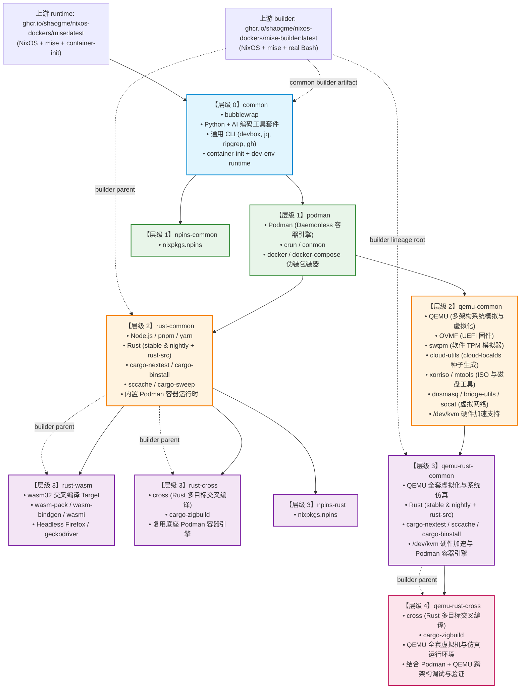
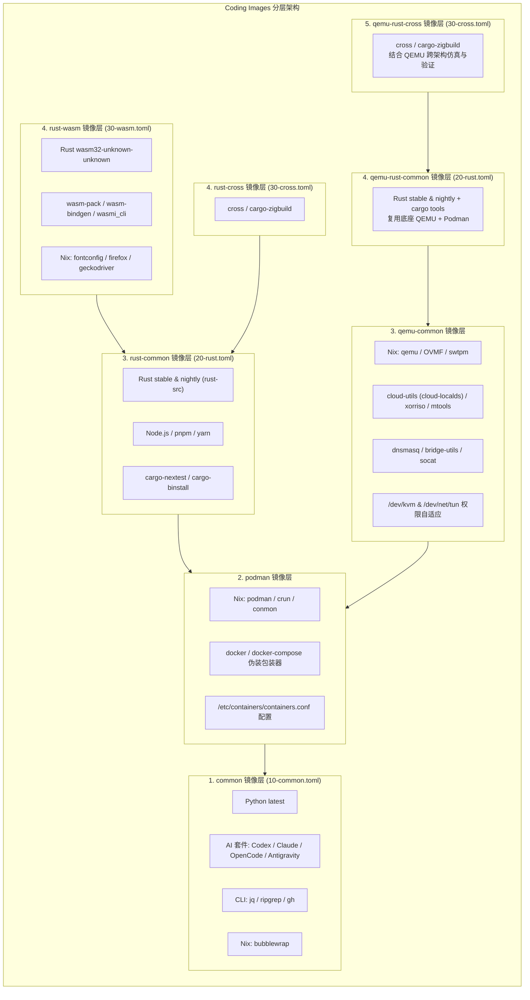
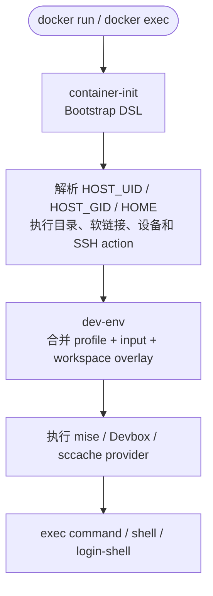
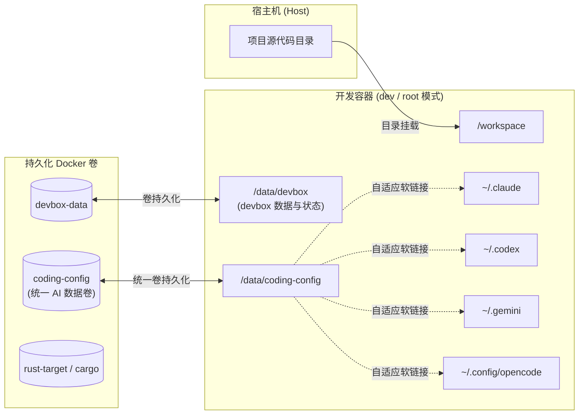
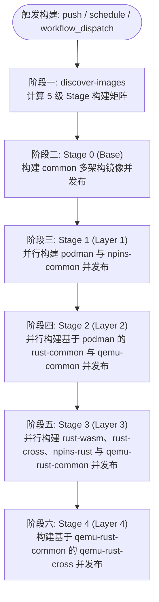

# Coding Images

Coding Images 是一个面向现代化云原生与本地开发的容器镜像仓库。所有镜像均基于 NixOS 与 mise 版本管理器构建，原生支持 `linux/amd64` 与 `linux/arm64` 双架构，采用树状分层继承架构（`common` -> `podman` / `npins-common` -> `rust-common` / `qemu-common` -> `rust-wasm` / `rust-cross` / `npins-rust` / `qemu-rust-common` -> `qemu-rust-cross`），集成了主流 AI 编程助手 CLI（OpenAI Codex、Claude Code、OpenCode、Antigravity CLI）以及现代语言与工具链，旨在为开发者提供开箱即用、环境一致且极低维护成本的编程工作区。

---

## 目录

- [核心特性](#核心特性)
- [镜像继承拓扑与环境清单](#镜像继承拓扑与环境清单)
  - [继承关系拓扑图](#继承关系拓扑图)
  - [1. common (基础开发环境)](#1-common-基础开发环境)
  - [2. podman (Podman 容器引擎环境)](#2-podman-podman-容器引擎环境)
  - [3. npins-common (Nix/npins 通用环境)](#3-npins-common-nixnpins-通用环境)
  - [4. rust-common (Rust 核心开发环境)](#4-rust-common-rust-核心开发环境)
  - [5. qemu-common (QEMU 虚拟机与配套设施环境)](#5-qemu-common-qemu-虚拟机与配套设施环境)
  - [6. npins-rust (Nix/npins + Rust 环境)](#6-npins-rust-nixnpins--rust-环境)
  - [7. rust-wasm (Rust WebAssembly 环境)](#7-rust-wasm-rust-webassembly-环境)
  - [8. rust-cross (Rust 交叉编译与容器环境)](#8-rust-cross-rust-交叉编译与容器环境)
  - [9. qemu-rust-common (QEMU + Rust 核心开发环境)](#9-qemu-rust-common-qemu--rust-核心开发环境)
  - [10. qemu-rust-cross (QEMU + Rust 交叉编译与仿真运行环境)](#10-qemu-rust-cross-qemu--rust-交叉编译与仿真运行环境)
- [镜像架构与设计机制](#镜像架构与设计机制)
  - [树状分层与 mise conf.d 模块化配置](#树状分层与-mise-confd-模块化配置)
  - [统一 container-init 与 dev-env 运行时](#统一-container-init-与-dev-env-运行时)
  - [容器开发模式与配置持久化](#容器开发模式与配置持久化)
- [快速开始](#快速开始)
  - [使用 Docker 直接运行](#使用-docker-直接运行)
  - [使用 Docker Compose 进行开发](#使用-docker-compose-进行开发)
  - [使用 Dev Containers 进行开发 (VS Code / Cursor / Zed)](#使用-dev-containers-进行开发-vs-code--cursor--zed)
- [本地开发与构建](#本地开发与构建)
  - [镜像目录规范](#镜像目录规范)
  - [镜像自动发现脚本](#镜像自动发现脚本)
  - [本地一键拓扑构建](#本地一键拓扑构建)
- [CI/CD 自动化构建与发布](#cicd-自动化构建与发布)
  - [分阶段 (Staged Matrix) 原生构建流水线](#分阶段-staged-matrix-原生构建流水线)
  - [镜像标签管理策略](#镜像标签管理策略)
- [项目目录结构](#项目目录结构)

---

## 核心特性

- **树状分层继承架构**：镜像之间通过 `FROM` 构建继承链（`common` 作为基底，`rust-common` 继承 `common`，`rust-wasm` 继承 `rust-common`），杜绝重复下载与编译，层级复用率极高。
- **多架构原生构建**：通过 GitHub Actions 分别在 x86_64（`ubuntu-latest`）和 ARM64（`ubuntu-24.04-arm`）运行器上原生编译打包，避免 QEMU 模拟器的性能开销，生成统一的 Multi-Arch 镜像清单。
- **可复用的 BuildKit 缓存**：构建 job 启用 Docker containerd image store，在保留本地父级 archive 加载能力的同时使用独立的 builder/runtime GHA 与 registry cache scope。
- **声明式与模块化环境管理**：底层借助 NixOS 基础镜像提供干净可靠的系统级依赖，用户空间通过 `mise` 的系统与全局模块化配置（`/etc/mise/conf.d/`）按层级独立注入 Node.js、Python、Rust、WebAssembly 及各类 CLI 工具。
- **自适应 UID/GID 权限映射**：底层完全承接 NixOS 的自适应 UID/GID 权限映射机制（支持 `HOST_UID:HOST_GID` 环境变量或启动时自动探测挂载的 `/workspace` 工作区属主），使用 `su-exec` 切换至匹配的本地普通用户（默认 `dev`），彻底解决宿主机代码与容器构建产物的权限冲突问题。
- **全自动 Devbox 深度集成**：内置 `devbox` 及其 shell 集成，配合预置系统级配置、统一数据持久化（`/data/devbox`）与自适应权限映射，容器启动或切换目录时自动探测、初始化（支持 `DEVBOX_AUTO_INIT`）与加载 `devbox.json` 环境，开箱即用。
- **内置 AI 编程套件与统一存储**：在基础镜像 `common` 中预装主流终端 AI 编码工具（`@openai/codex`、`claude-code`、`opencode`、`antigravity-cli`），并通过统一数据卷与全局目录映射（`coding-config:/data/coding-config`）自动软链接汇聚 `~/.claude`、`~/.codex`、`~/.gemini` 与 `~/.config/opencode`，实现高内聚的一键凭证备份、迁移与跨镜像共享。
- **标准化 Dev Containers 规范支持**：全量在各层级镜像中预置标准化 `.devcontainer/devcontainer.json` 配置，将安全能力（`cap_add`、`seccomp`）、环境变量及持久化挂载声明为通用工业标准，开箱即用无缝支持 VS Code、Cursor、Zed 等现代容器化 IDE。
- **统一运行时入口**：所有镜像使用 `/usr/bin/container-init run --`，以声明式 Bootstrap DSL 处理身份、目录和设备，再由 `/usr/bin/dev-env` 物化 mise、Devbox、sccache 与 shell 环境，子镜像无需维护入口脚本。
- **独立的 Mise 构建阶段**：需要预装工具的镜像同时生成 `mise-builder` 与 `runtime` target。builder 沿 builder lineage 继承，runtime 沿 runtime lineage 继承；builder 只在同一 workflow 的短期 artifact 中传递，不发布到 GHCR。
- **明确的构建产物边界**：只复制 `/etc/mise`、`/usr/local/share/mise`、`/data/cache/mise` 以及 Rust 工具链的显式目录，不复制 builder 的 root 配置、临时文件或构建凭据。

---

## 镜像继承拓扑与环境清单

所有镜像均发布至 GitHub Container Registry（GHCR）：
`ghcr.io/<owner>/coding-images/<image-name>:<tag>`

### 继承关系拓扑图



---

### 1. common (基础开发环境)

所有编码镜像的基础底座，包含基础开发工具、通用 CLI 与完整的 AI 编程套件。

- **镜像地址**：`ghcr.io/shaogme/coding-images/common:latest`
- **基础镜像**：`ghcr.io/shaogme/nixos-dockers/mise:latest`
- **构建阶段镜像**：`ghcr.io/shaogme/nixos-dockers/mise-builder:<NIXOS_DOCKERS_VERSION>`（仅用于 `mise lock/install`）
- **系统包（Nix）**：`bubblewrap`（沙箱隔离支持）
- **开发语言与运行时（mise）**：Python `latest`
- **AI 辅助工具**：`@openai/codex`、`claude-code`、`opencode`、`antigravity-cli`
- **通用与环境工具**：`devbox`、`jq`、`ripgrep`、`gh`（GitHub CLI）
- **核心组件**：`container-init` Bootstrap runtime、`dev-env` environment materializer、声明式 Devbox 自动初始化与加载环境支持

`common` 的全局工具由 builder stage 安装后通过白名单 `rsync` 同步到 runtime。`mise-builder` 本身不包含
`container-init`、`dev-env` 或运行时 Bash shim，不能作为开发容器直接运行。

### 2. podman (Podman 容器引擎环境)

在 `common` 基础上扩展 Podman 容器运行时环境，原生支持免守护进程容器执行（DinD/PinP）。

- **镜像地址**：`ghcr.io/shaogme/coding-images/podman:latest`
- **基础镜像**：`ghcr.io/shaogme/coding-images/common:latest`
- **Builder**：passthrough，复用 `common` builder artifact，不生成新的 builder archive
- **包含 common 的所有环境**，并额外增加：
  - **系统包（Nix）**：`podman`、`crun`、`conmon`、`podman-compose`
  - **Docker 命令与编排透明兼容**：通过 `dev-env` 声明式提供 `/usr/local/bin/docker` 与 `/usr/local/bin/docker-compose` 符号链接及 `/var/run/docker.sock` 软链接；完整支持 `docker compose`、`docker-compose`、`podman compose` 与 `podman-compose`
  - **容器引擎配置**：预置 `/etc/containers/containers.conf`（`cgroupfs` 资源管理器、`file` 事件日志、`crun` 运行时、`podman-compose` 编排提供器）
  - **单一卷持久化**：统一通过 `podman-containers:/var/lib/containers` 独立命名卷持久化容器及镜像；`dev-env` 自动建立软链接使 `root`（`/var/lib/containers/storage`）与 `dev`（`/var/lib/containers/dev/storage`）互不冲突地共用该单一卷持久化数据

### 3. npins-common (Nix/npins 通用环境)

在 `common` 基础上扩展 npins 依赖锁定工具。

- **镜像地址**：`ghcr.io/shaogme/coding-images/npins-common:latest`
- **基础镜像**：`ghcr.io/shaogme/coding-images/common:latest`
- **Builder**：passthrough，复用 `common` builder artifact，不生成新的 builder archive
- **包含 common 的所有环境**，并额外增加系统包：`nixpkgs.npins`

### 4. rust-common (Rust 核心开发环境)

专为 Rust 核心开发打造的完整环境，直接基于 `podman` 镜像构建，全量具备开箱即用的 Podman 容器运行时，集成稳定版与每日构建版编译器及前端辅助工具链。

- **镜像地址**：`ghcr.io/shaogme/coding-images/rust-common:latest`
- **基础镜像**：`ghcr.io/shaogme/coding-images/podman:latest`
- **Builder parent**：`common` builder artifact
- **包含 podman 的所有环境**（具备开箱即用的 Podman 容器运行时），并额外增加：
  - **开发语言与运行时（mise）**：
    - Rust: `stable`（包含 `rust-src` 源码组件）
    - Rust: `nightly`（包含 `rust-src` 源码组件）
    - Node.js: `latest`、pnpm: `latest`、yarn: `latest`
  - **Rust 专属扩展工具**：
    - `cargo-nextest`（Rust 快速测试运行器）
    - `cargo-binstall`（二进制快速安装工具）
    - `sccache`（编译缓存工具）
    - `cargo-sweep`（构建产物清理工具）
  - **Nightly 工具链多架构别名桥接（Symlink Alias）**：
    通过 `mise` 声明式统一管理并锁定特定日期的 `nightly` 版本快照（保证构建确定性与缓存稳定性），在构建阶段自适应宿主架构（`x86_64` / `aarch64`）在 `$RUSTUP_HOME/toolchains` 中自动建立 `nightly-<triple>` 与 `nightly` 软链接别名，无缝兼容 `cargo +nightly`、`rustup target add` 与各类 IDE 插件的原生习惯。

### 5. qemu-common (QEMU 虚拟机与配套设施环境)

在 `podman` 镜像基础上深度扩展完整 QEMU 虚拟化与系统仿真环境，同时具备 Podman 容器引擎与免守护进程的虚拟机运行能力，支持 UEFI 引导、vTPM 2.0、Cloud-Init 快速部署与虚拟网桥。

- **镜像地址**：`ghcr.io/shaogme/coding-images/qemu-common:latest`
- **基础镜像**：`ghcr.io/shaogme/coding-images/podman:latest`
- **Builder**：passthrough，复用 `common` builder artifact，不生成新的 builder archive
- **包含 podman 的所有环境**（具备开箱即用的 Podman 容器运行时与 Docker 透明伪装），并额外增加：
  - **系统包（Nix）**：
    - `qemu`：多架构系统模拟器（`qemu-system-x86_64`、`qemu-system-aarch64` 等）、虚拟磁盘管理（`qemu-img`）、网络块设备（`qemu-nbd`）
    - `OVMF.fd`：UEFI 固件套件（自动软链接至 `/usr/share/OVMF/` 与 `/usr/share/qemu/`）
    - `swtpm`：软件 TPM 模拟器，全面支持 Windows 11、Linux 安全启动及 TPM 2.0 认证
    - `cloud-utils`：内置 `cloud-localds`，支持极速生成 cloud-init NoCloud 种子镜像
    - `xorriso`、`mtools`：ISO 制作与免挂载读写 FAT/EFI 分区工具
    - `dnsmasq`、`bridge-utils`、`socat`：虚拟网络桥接、DHCP/DNS 服务分配与 QMP 控制套接字中继
  - **硬件加速与无缝权限映射**：
    - 预建 `kvm` 用户组并自动将 `dev` 用户加入该组
    - Compose / Dev Container 显式传入 `/dev/kvm`、`/dev/net/tun` 与 `/dev/fuse`；设备节点权限由宿主机和容器运行时控制，镜像启动不会尝试修改宿主设备
  - **Docker Compose 支持**：提供 `devices: [/dev/kvm, /dev/net/tun, /dev/fuse]` 与 `qemu-data:/data/qemu` 独立持久化卷（用于持久化 VM 镜像与 cloud-init 配置文件）

### 6. npins-rust (Nix/npins + Rust 环境)

在 `rust-common` 基础上扩展 npins 工具。

- **镜像地址**：`ghcr.io/shaogme/coding-images/npins-rust:latest`
- **基础镜像**：`ghcr.io/shaogme/coding-images/rust-common:latest`
- **Builder**：passthrough，复用 `rust-common` builder artifact，不生成新的 builder archive
- **包含 rust-common 的所有环境**，并额外增加系统包：`nixpkgs.npins`

### 7. rust-wasm (Rust WebAssembly 环境)

在 `rust-common` 基础上扩展 WebAssembly 交叉编译与 Headless 浏览器测试环境。

- **镜像地址**：`ghcr.io/shaogme/coding-images/rust-wasm:latest`
- **基础镜像**：`ghcr.io/shaogme/coding-images/rust-common:latest`
- **Builder parent**：`rust-common` builder artifact
- **包含 rust-common 的所有环境**，并额外增加：
  - **系统包（Nix）**：`fontconfig`、`dejavu_fonts`、`mesa`、`firefox`、`geckodriver`
  - **Rust 交叉编译 Target**：`wasm32-unknown-unknown`（针对 `stable` 和 `nightly`）
  - **WebAssembly 工具链**：`wasm-pack`、`wasm-bindgen-cli`、`wasmi_cli`
  - **环境配置**：静默 Firefox 企业策略与 Headless 渲染配置

### 8. rust-cross (Rust 交叉编译与容器环境)

在 `rust-common` 基础上扩展 Rust 交叉编译套件，直接复用底座由 `podman` 镜像赋予的容器引擎能力，原生支持在容器内免后台守护进程执行 `cross` 多架构交叉编译。

- **镜像地址**：`ghcr.io/shaogme/coding-images/rust-cross:latest`
- **基础镜像**：`ghcr.io/shaogme/coding-images/rust-common:latest`
- **Builder parent**：`rust-common` builder artifact
- **包含 rust-common 的所有环境**（直接继承底层 Podman 容器引擎），并额外增加：
  - **交叉编译工具链**：`cross`（官方多目标交叉编译 CLI，基于 `cargo-binstall` 安装）、`cargo-zigbuild`
  - **轻量解耦设计**：Podman、运行时配置与 Docker 透明伪装已由基础层 `podman` / `rust-common` 提供，`rust-cross` 聚焦于跨平台编译工具链本身，杜绝重复安装
  - **Docker Compose 支持**：继承统一的 `devices: [/dev/fuse, /dev/net/tun]` 与 `podman-containers` 命名卷持久化机制

### 9. qemu-rust-common (QEMU + Rust 核心开发环境)

在 `qemu-common` 基础上扩展完整的 Rust 核心开发环境，结合 QEMU 虚拟机运行能力、KVM 硬件加速与 Rust 编译器及快速测试工具链，直接满足基于虚拟机或真实硬件仿真的系统级 Rust 开发（如操作系统内核、底层驱动、嵌入式固件等）。

- **镜像地址**：`ghcr.io/shaogme/coding-images/qemu-rust-common:latest`
- **基础镜像**：`ghcr.io/shaogme/coding-images/qemu-common:latest`
- **Builder parent**：`qemu-common` builder lineage（内容复用 `common` builder artifact）
- **包含 qemu-common 的所有环境**（具备开箱即用的 QEMU 全套组件、OVMF 固件、swtpm、KVM 硬件加速与 Podman 容器运行时），并额外增加：
  - **开发语言与运行时（mise）**：
    - Rust: `stable`（包含 `rust-src` 源码组件）
    - Rust: `nightly`（包含 `rust-src` 源码组件）
  - **Rust 专属扩展工具**：
    - `cargo-nextest`（Rust 快速测试运行器）
    - `cargo-binstall`（二进制快速安装工具）
    - `sccache`（编译缓存工具）
    - `cargo-sweep`（构建产物清理工具）
  - **硬件加速与统一持久化**：
    - 预置 `/dev/kvm`、`/dev/net/tun`、`/dev/fuse` 节点支持与 `kvm` 用户组
    - 支持 `qemu-data:/data/qemu`、`rust-target:/data/.cargo/target`、`cache:/data/cache`、`podman-containers` 与统一 `coding-config`

### 10. qemu-rust-cross (QEMU + Rust 交叉编译与仿真运行环境)

在 `qemu-rust-common` 基础上扩展 Rust 跨架构交叉编译工具链，结合底座内置的 Podman 容器引擎与 QEMU 仿真/虚拟化环境，原生支持 `cross` 多目标构建并能在容器内直接利用 QEMU 模拟目标架构或启动轻量虚拟机进行执行、测试与验证。

- **镜像地址**：`ghcr.io/shaogme/coding-images/qemu-rust-cross:latest`
- **基础镜像**：`ghcr.io/shaogme/coding-images/qemu-rust-common:latest`
- **Builder parent**：`qemu-rust-common` builder artifact
- **包含 qemu-rust-common 的所有环境**（具备 QEMU 仿真环境、KVM 加速、Rust 编译器套件与 Podman 引擎），并额外增加：
  - **交叉编译工具链**：`cross`（官方多目标交叉编译 CLI，基于 `cargo-binstall` 安装）、`cargo-zigbuild`
  - **cross 运行时引擎指定**：预置 `CROSS_CONTAINER_ENGINE=podman`
  - **跨架构全链路闭环**：通过 cross 完成跨平台编译，借助 QEMU 系统与用户态模拟直接测试目标产物，开箱即用
  - **Docker Compose 支持**：提供全量虚拟化设备映射与持久化卷


---

## 镜像架构与设计机制

### 树状分层与 mise conf.d 模块化配置



1. **配置模块化**：各镜像通过全局 `/etc/mise/conf.d/` 目录独立注入增量配置：
   - `10-common.toml` -> 由 `common` 注入
   - `20-rust.toml` -> 由 `rust-common` 与 `qemu-rust-common` 注入
   - `30-wasm.toml` -> 由 `rust-wasm` 注入（继承并添加 Rust WebAssembly targets）
   - `30-cross.toml` -> 由 `rust-cross` 与 `qemu-rust-cross` 注入（继承并配置 `cross` 交叉编译工具）
2. **全局版本锁定（Global Lockfile）**：各镜像在构建时通过 `mise lock --global` 固化当前工具链的确定性版本与 options/targets 元数据，杜绝 `nightly` 跨天版本漂移与 Target 继承丢失。

### 统一 container-init 与 dev-env 运行时

所有镜像继承 NixOS Docker 的 Docker `Entrypoint`：
`["/usr/bin/container-init", "run", "--"]`。



Bootstrap 和 environment 是两个独立 namespace：`container-init` 不包含 mise、Devbox、sccache 或 AI 工具分支；`dev-env` 不负责 UID/GID、SSH 或 root filesystem action。`/bin/bash` 是指向 `dev-env` 的兼容 shim，真实 Bash 保存在 `/usr/local/libexec/dev-env/real/bash`。

### Devbox 环境加载机制

- 工作区存在 `devbox.json` 时，`devbox-project` provider 按声明执行 `install` 和 `shellenv`。
- `DEVBOX_AUTO_INIT=1` 或 `true` 会将 `features.devbox.auto_init` 设为 `if-missing`，仅在工作区没有配置且可写时执行 `devbox init`。
- `dev-env print`、`dev-env exec`、shell shim、SSH login shell 和 `docker exec ... dev-env` 都从同一 profile chain 重新物化环境。
- Devbox 数据、Cargo target、sccache 和 AI 配置目录由 profile 的环境变量及 Bootstrap action 指向 `/data` 下的持久化卷。

### 容器开发模式与配置持久化

各镜像深度整合主流 AI 编程助手（Claude Code、OpenAI Codex、OpenCode、Antigravity CLI）与 devbox 数据持久化。

#### 统一 AI 凭证与存储映射策略

为了避免在 Compose 或容器运行参数中分别声明 `~/.claude`、`~/.codex`、`~/.gemini`、`~/.config/opencode` 等多个分散的命名卷，Coding Images 实施统一的高内聚存储映射策略：

1. **全局统一存储卷**：所有 AI 编程工具的会话状态、认证 Token 与配置文件全部汇聚持久化到单一命名数据卷 `coding-config:/data/coding-config`，devbox 数据与状态统一持久化至 `devbox-data:/data/devbox`。
2. **启动自适应软链接**：`container-init` 按 derived Bootstrap profile 在当前目标用户的主目录下创建指向 `/data/coding-config` 子目录的软链接：
   - `${USER_HOME}/.claude` -> `/data/coding-config/claude`
   - `${USER_HOME}/.codex` -> `/data/coding-config/codex`
   - `${USER_HOME}/.gemini` -> `/data/coding-config/gemini`
   - `${USER_HOME}/.config/opencode` -> `/data/coding-config/opencode`
3. **备份与共享内聚**：开发者只需挂载或备份统一的数据卷（`coding-config`、`devbox-data`、`cargo`），即可完成环境状态保留与跨容器共享。devbox 数据路径通过全局环境变量 `XDG_DATA_HOME=/data` 直接读写 `/data/devbox`；Cargo registry 和 git checkout 统一位于 `/data/cargo`，分别从两个 HOME 的 `.cargo` 目录链接过去。



> [!TIP]
> **统一用户家目录与自适应权限**：
> 非 root 开发用户使用 `/home/dev`，root 使用 `/root` 作为 `$HOME`。
> 启动时容器引导层（`container-init`）会按当前身份校准对应 HOME 及其私有目录的所有权和权限。
> 若需切换为 root 身份运行，只需在启动时传入环境变量：
>
> ```bash
> RUN_AS_ROOT=1 docker compose up -d
> ```
>
> Codex、Claude、Gemini 和 OpenCode 配置在两个 HOME 下保持相同的共享链接；需要共享的持久化卷分别挂载到 `/home/dev` 和 `/root`。

---

## 快速开始

### 使用 Docker 直接运行

以 `rust-wasm` 镜像为例，启动交互式容器：

```bash
docker run -it --rm \
  -e HOST_UID=$(id -u):$(id -g) \
  -v $(pwd):/workspace \
  -v coding-config:/data/coding-config \
  --cap-add=SYS_ADMIN \
  --cap-add=SYS_PTRACE \
  --security-opt apparmor=unconfined \
  --security-opt seccomp=unconfined \
  ghcr.io/shaogme/coding-images/rust-wasm:latest bash
```

### 使用 Docker Compose 进行开发

以 `images/rust/common` 为例，标准的 `docker-compose.yml` 编排配置如下：

```yaml
# Base configuration for the application
x-app-base: &app-base
  image: ghcr.io/shaogme/coding-images/rust-common:latest
  environment:
    - DEVBOX_AUTO_INIT=${DEVBOX_AUTO_INIT:-0} # Auto-initialize devbox.json if not present
    - HOST_UID # Set HOST_UID=host_uid[:host_gid] explicitly; otherwise infer the mounted workspace owner
    - CARGO_INCREMENTAL=${CARGO_INCREMENTAL:-0} # Disabled by default for sccache caching compatibility
    - CARGO_TARGET_DIR=/data/.cargo/target # Isolate Rust target directory to persistent data volume
    - SCCACHE_DIR=/data/cache/sccache # Directory for sccache compiler cache storage
    - SCCACHE_DISABLE=${SCCACHE_DISABLE:-0} # Set to 1 to explicitly disable sccache
  security_opt:
    - seccomp:unconfined
    - apparmor:unconfined
    - systempaths:unconfined
  cap_add:
    - SYS_ADMIN
    - NET_ADMIN
    - SYS_PTRACE
  devices:
    - /dev/fuse:/dev/fuse # Allow fuse-overlayfs inside container
    - /dev/net/tun:/dev/net/tun # Allow TUN/TAP devices for Podman to create network interfaces
  tty: true

services:
  # Develop mode: Mounts local directory for hot-reloading (Default)
  dev:
    <<: *app-base
    container_name: rust-common-dev
    volumes:
      # Mount host source code
      - .:/workspace
      # Isolate Rust build artifacts inside a dedicated named Docker volume (high-performance Linux ext4)
      - rust-target:/data/.cargo/target
      # Persist Cargo dependencies, crate index, and git checkouts
      - cargo:/data/cargo
      # Persist cache
      - cache:/data/cache
      # Persist Podman containers and cached container images
      - podman-containers:/var/lib/containers
      # Persist devbox data
      - devbox-data:/data/devbox
      # Persist unified AI credentials and tool configurations
      - coding-config:/data/coding-config

volumes:
  rust-target:
  cargo:
  cache:
  podman-containers:
  devbox-data:
  coding-config:

```

启动并进入开发环境：

```bash
cd images/rust/common
docker compose up -d dev
docker compose exec dev bash
```

### 使用 Dev Containers 进行开发 (VS Code / Cursor / Zed)

现代 IDE（VS Code、Cursor、Zed、DevPod 等）已广泛支持并原生依赖 [Dev Containers 规范](https://containers.dev)（`.devcontainer/devcontainer.json`）。

Coding Images 为各层级镜像及仓库根目录均内置了对应的标准化 `.devcontainer/devcontainer.json`，把安全能力（`cap_add`）、安全配置（`security_opt`）、环境变量以及持久化挂载统一声明为工业标准规范：

以 `images/rust/wasm/.devcontainer/devcontainer.json` 为例：

```json
{
  "name": "Coding Images - Rust WASM",
  "image": "ghcr.io/shaogme/coding-images/rust-wasm:latest",
  "workspaceFolder": "/workspace",
  "workspaceMount": "source=${localWorkspaceFolder},target=/workspace,type=bind",
  "remoteUser": "dev",
  "capAdd": [
    "SYS_ADMIN",
    "NET_ADMIN",
    "SYS_PTRACE"
  ],
  "securityOpt": [
    "seccomp=unconfined",
    "apparmor=unconfined",
    "systempaths=unconfined"
  ],
  "runArgs": [
    "--device=/dev/fuse",
    "--device=/dev/net/tun"
  ],
  "containerEnv": {
    "CARGO_INCREMENTAL": "0",
    "CARGO_TARGET_DIR": "/data/.cargo/target",
    "SCCACHE_DIR": "/data/cache/sccache"
  },
  "mounts": [
    "source=rust-target,target=/data/.cargo/target,type=volume",
    "source=cargo,target=/data/cargo,type=volume",
    "source=cache,target=/data/cache,type=volume",
    "source=podman-containers,target=/var/lib/containers,type=volume",
    "source=devbox-data,target=/data/devbox,type=volume",
    "source=coding-config,target=/data/coding-config,type=volume"
  ],
  "customizations": {
    "vscode": {
      "extensions": [
        "rust-lang.rust-analyzer",
        "tamasfe.even-better-toml",
        "serayuzgur.crates",
        "webassembly.webassembly-studio-extension"
      ],
      "settings": {
        "rust-analyzer.check.command": "clippy"
      }
    }
  }
}

```

#### 使用步骤

1. **VS Code / Cursor**：
   - 打开包含 `.devcontainer` 的目录（例如将对应层级的 `.devcontainer` 复制至自己的工程根目录，或直接打开本仓库）。
   - 按 `F1` 或 `Ctrl+Shift+P`，输入并执行 `Dev Containers: Reopen in Container`。
   - IDE 将自动拉取镜像、挂载统一 `coding-config` 数据卷、加载安全能力并安装预配置插件。
2. **Zed**：
   - 使用 Zed 打开包含 `.devcontainer/devcontainer.json` 的工程目录。
   - 在右下角或命令面板中选择 `Open in Container`，Zed 将解析标准配置并在隔离容器中启动远程开发服务。

---

## 本地开发与构建

### 镜像目录规范

所有镜像均存放在 `images/` 目录下：

``` txt
images/rust/wasm/
├── .config/
│   └── mise.toml         # 该镜像的增量 mise 工具清单 (30-wasm.toml)
├── .devcontainer/
│   └── devcontainer.json # 对应层级的 Dev Container 标准化配置
├── docker/
│   └── Dockerfile        # 镜像构建定义 (FROM coding-images/rust-common)
└── docker-compose.yml    # 本地容器编排配置
```

### Mise builder/runtime 双轨

凡是需要在 Docker 构建阶段执行 `mise trust`、`mise lock` 或 `mise install` 的镜像，
都必须声明 `mise-builder` 和 `runtime` 两个 target。builder parent 与 runtime parent
是两个独立参数，只有 builder 的受控目录会通过 BuildKit bind mount + `rsync` 进入
runtime：

```dockerfile
ARG NIXOS_DOCKERS_VERSION=latest
ARG RUNTIME_PARENT_IMAGE=ghcr.io/shaogme/nixos-dockers/mise:${NIXOS_DOCKERS_VERSION}
ARG BUILDER_PARENT_IMAGE=ghcr.io/shaogme/nixos-dockers/mise-builder:${NIXOS_DOCKERS_VERSION}

FROM ${RUNTIME_PARENT_IMAGE} AS runtime-base

FROM ${BUILDER_PARENT_IMAGE} AS mise-builder
COPY .config/mise.toml /etc/mise/conf.d/10-project.toml
RUN --mount=type=secret,id=GITHUB_TOKEN,required=false \
    if [ -f /run/secrets/GITHUB_TOKEN ]; then export GITHUB_TOKEN="$(cat /run/secrets/GITHUB_TOKEN)"; fi; \
    set -eu; \
    mise trust --all; \
    mise lock --global --platform linux-x64,linux-arm64; \
    mise install

FROM runtime-base AS runtime
RUN nix profile add nixpkgs#rsync
RUN --mount=type=bind,from=mise-builder,target=/mnt/mise-builder,ro \
    set -eu; \
    for path in /etc/mise /usr/local/share/mise /data/cache/mise; do \
        mkdir -p "$path"; \
        rsync -aH --checksum --omit-dir-times \
            "/mnt/mise-builder$path/" "$path/"; \
    done
```

不要在 runtime stage 中执行 Mise 安装，也不要同步 builder 的 `/root`、`/tmp`、
`/run/secrets` 或完整 `/usr/local`。builder archive 只在当前 workflow 的 job 之间
传递，最终用户只接触 runtime 镜像；`latest` 不是 builder 标签。

### 镜像自动发现脚本

```bash
# 查看帮助
python3 scripts/discover_images.py --help

# 以分阶段格式输出
python3 scripts/discover_images.py --format stages

# 以 GitHub Actions 矩阵格式输出
python3 scripts/discover_images.py --format matrix
```

### 本地一键拓扑构建

仓库内置了 `scripts/build_local.sh` 脚本，支持按依赖层级拓扑构建镜像：

```bash
# 构建全部镜像（按 Stage 0 -> Stage 1 -> Stage 2 -> Stage 3 -> Stage 4 拓扑构建）
./scripts/build_local.sh all

# 单独构建指定镜像（如 rust-wasm、qemu-rust-cross）
./scripts/build_local.sh rust-wasm

# 使用固定的上游 runtime/builder 版本构建，避免两个 tag 在构建期间漂移
NIXOS_DOCKERS_VERSION=2026.8.24 ./scripts/build_local.sh common
```

单目标构建会先构建它的 runtime ancestor closure。每个 Mise image 的 builder target
会输出 `builder-<image>-<arch>.tar.gz` 和 SHA-256 sidecar，加载后以本地 lineage tag
供下一级使用；passthrough 层直接复用最近的 builder artifact，不重新打包。

---

## CI/CD 自动化构建与发布

### 分阶段 (Staged Matrix) 原生构建流水线



1. **Stage 0 (Base)**：构建 `common`，在 x86_64 和 ARM64 上原生构建；其 builder parent 使用同版本的上游 `nixos-dockers/mise-builder`。
2. **Stage 1 (Layer 1)**：并行构建基于 `common` 的 `podman` 与 `npins-common`。
3. **Stage 2 (Layer 2)**：并行构建基于 `podman` 的 `rust-common` 与 `qemu-common`。
4. **Stage 3 (Layer 3)**：并行构建基于 `rust-common` 的 `rust-wasm`、`rust-cross`、`npins-rust` 与基于 `qemu-common` 的 `qemu-rust-common`。
5. **Stage 4 (Layer 4)**：构建基于 `qemu-rust-common` 的 `qemu-rust-cross`。

每个架构 job 都上传 `runtime-<image>-<arch>.tar.gz` 及校验文件；有 Mise 增量的镜像
另外上传同名 builder archive。`push=false` 只关闭 runtime GHCR 发布，不能跳过内部
artifact。merge job 只加载和推送 runtime archive，不创建 builder 标签或 manifest。

### 镜像标签管理策略

- `latest`：指向主分支最新构建。
- `<YYYYMMDD>`：按构建日期打标（例如 `20260829`）。
- `sha-<commit_sha>`：关联特定的 Git commit（例如 `sha-a1b2c3d`）。
- `<extra_tag>`（可选）：手动触发时指定的自定义标签。
- `nixos_dockers_version`：手动构建时固定上游 `mise` 与 `mise-builder` 的共同版本；生产构建应使用不可变版本 tag，而不是让 runtime 和 builder 分别跟随不同的 `latest`。

---

## 项目目录结构

``` txt
.
├── .devcontainer/
│   └── devcontainer.json            # 根工作区 Dev Container 标准化配置
├── .github/
│   └── workflows/
│       ├── build-and-publish.yml    # 5 阶段拓扑编排工作流
│       └── build-single-image.yml   # 跨架构原生构建与 Manifest 合并复用工作流
├── images/
│   ├── common/
│   │   ├── .config/
│   │   │   ├── mise.toml            # common 基础与 devbox 工具 (10-common.toml)
│   │   │   └── dev-env.toml         # coding-images environment/bootstrap profile
│   │   ├── .devcontainer/
│   │   │   └── devcontainer.json    # common Dev Container 配置
│   │   ├── docker/
│   │   │   ├── Dockerfile           # common 多阶段构建规则 (mise-builder -> nixos-dockers/mise)
│   │   ├── tests/
│   │   │   └── docker.sh            # common Docker 构建/部署/可用性测试
│   │   └── docker-compose.yml
│   ├── npins/
│   │   ├── common/
│   │   │   ├── .devcontainer/
│   │   │   │   └── devcontainer.json # npins-common Dev Container 配置
│   │   │   ├── docker/
│   │   │   │   └── Dockerfile       # npins-common 构建规则 (FROM common)
│   │   │   └── docker-compose.yml
│   │   └── rust/
│   │       ├── .devcontainer/
│   │       │   └── devcontainer.json # npins-rust Dev Container 配置
│   │       ├── docker/
│   │       │   └── Dockerfile       # npins-rust 构建规则 (FROM rust-common)
│   │       └── docker-compose.yml
│   ├── podman/
│   │   ├── .devcontainer/
│   │   │   └── devcontainer.json    # podman Dev Container 配置
│   │   ├── docker/
│   │   │   └── Dockerfile           # podman 构建规则 (FROM common)
│   │   └── docker-compose.yml
│   ├── qemu/
│   │   ├── common/
│   │   │   ├── .devcontainer/
│   │   │   │   └── devcontainer.json # qemu-common Dev Container 配置
│   │   │   ├── docker/
│   │   │   │   └── Dockerfile       # qemu-common 构建规则 (FROM podman)
│   │   │   ├── .config/
│   │   │   │   └── dev-env.toml     # QEMU Bootstrap action profile
│   │   │   ├── tests/
│   │   │   │   └── docker.sh        # qemu-common Docker 可用性测试
│   │   │   └── docker-compose.yml
│   │   └── rust/
│   │       ├── common/
│   │       │   ├── .config/
│   │       │   │   └── mise.toml    # Rust 增量工具 (20-rust.toml)
│   │       │   ├── .devcontainer/
│   │       │   │   └── devcontainer.json # qemu-rust-common Dev Container 配置
│   │       │   ├── docker/
│   │       │   │   └── Dockerfile   # qemu-rust-common 构建规则 (FROM qemu-common)
│   │       │   └── docker-compose.yml
│   │       └── cross/
│   │           ├── .config/
│   │           │   └── mise.toml    # 交叉编译工具配置 (30-cross.toml)
│   │           ├── .devcontainer/
│   │           │   └── devcontainer.json # qemu-rust-cross Dev Container 配置
│   │           ├── docker/
│   │           │   └── Dockerfile   # qemu-rust-cross 构建规则 (FROM qemu-rust-common)
│   │           └── docker-compose.yml
│   └── rust/
│       ├── common/
│       │   ├── .config/
│       │   │   └── mise.toml        # Rust & Node 增量工具 (20-rust.toml)
│       │   ├── .devcontainer/
│       │   │   └── devcontainer.json # rust-common Dev Container 配置
│       │   ├── docker/
│       │   │   └── Dockerfile       # rust-common 构建规则 (FROM podman)
│       │   └── docker-compose.yml
│       ├── cross/
│       │   ├── .config/
│       │   │   └── mise.toml        # 交叉编译工具配置 (30-cross.toml)
│       │   ├── .devcontainer/
│       │   │   └── devcontainer.json # rust-cross Dev Container 配置
│       │   ├── docker/
│       │   │   └── Dockerfile       # rust-cross 构建规则 (FROM rust-common)
│       │   └── docker-compose.yml
│       └── wasm/
│           ├── .config/
│           │   └── mise.toml        # WASM 增量工具 (30-wasm.toml)
│           ├── .devcontainer/
│           │   └── devcontainer.json # rust-wasm Dev Container 配置
│           ├── docker/
│           │   └── Dockerfile       # rust-wasm 构建规则 (FROM rust-common)
│           └── docker-compose.yml
├── scripts/
│   ├── discover_images.py           # 扫描 images 目录并生成分阶段矩阵的脚本
│   └── build_local.sh               # 本地按依赖拓扑一键构建脚本
└── README.md                        # 项目主文档
```
