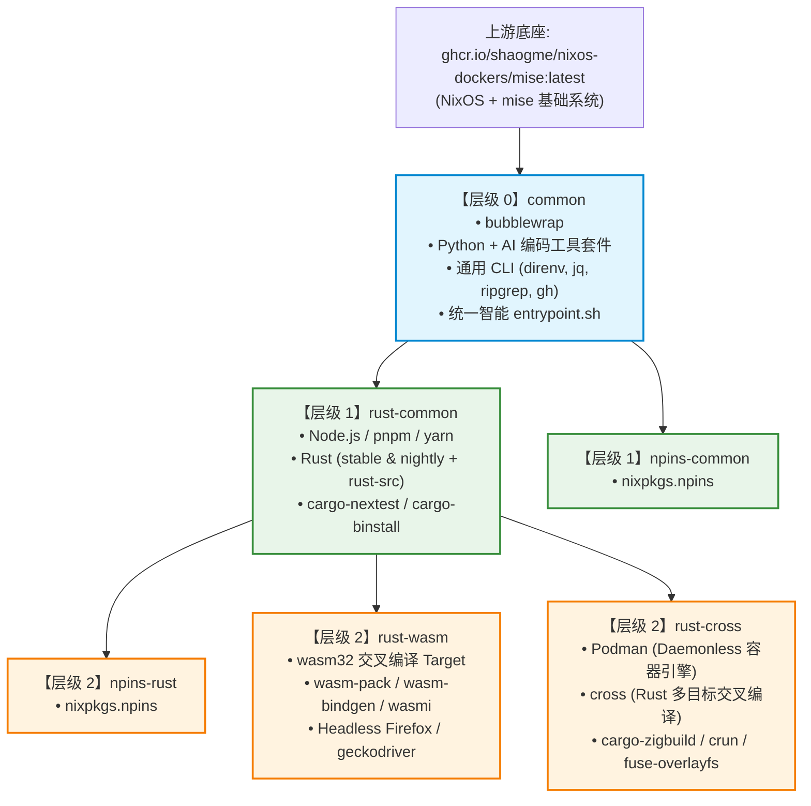
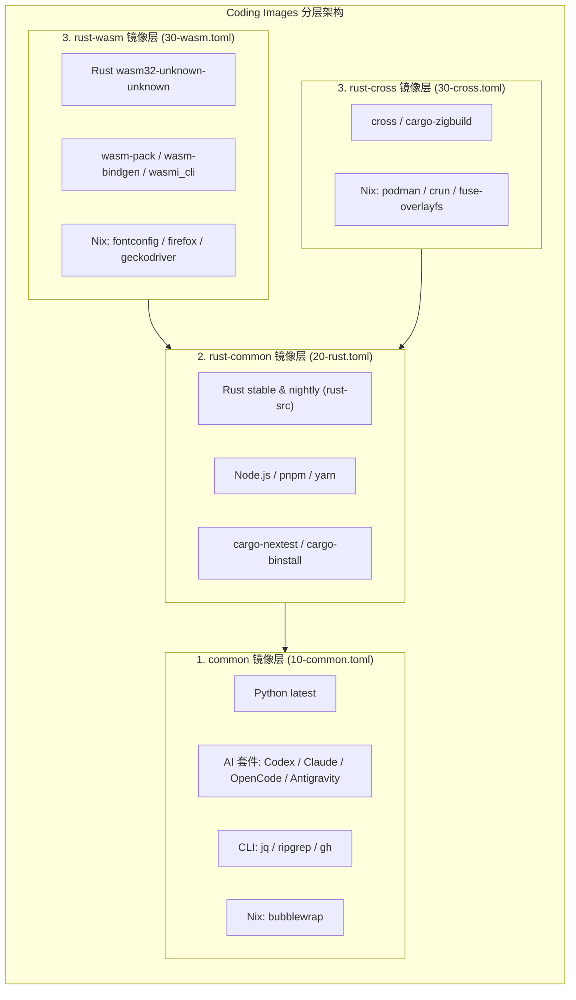
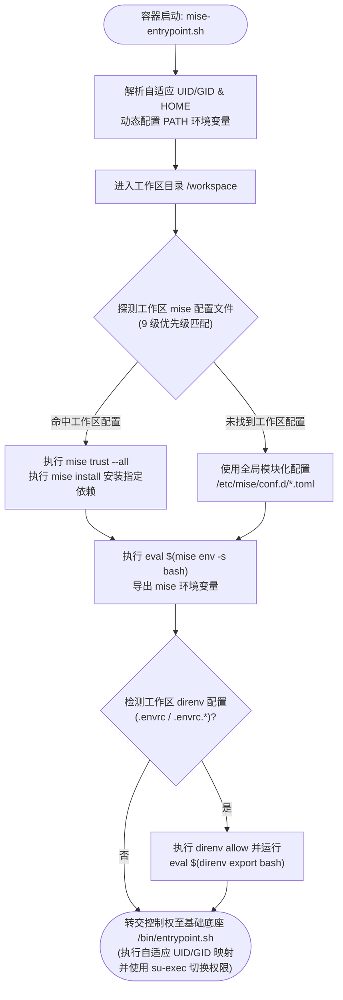
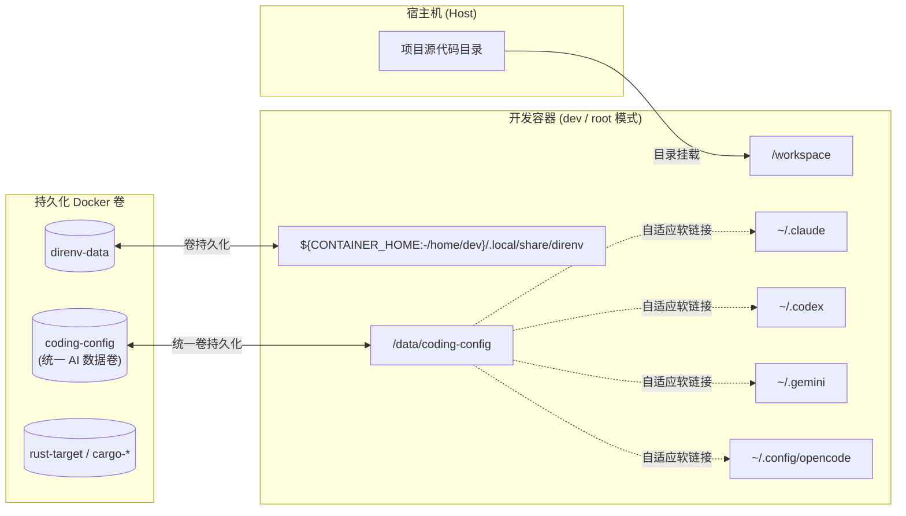
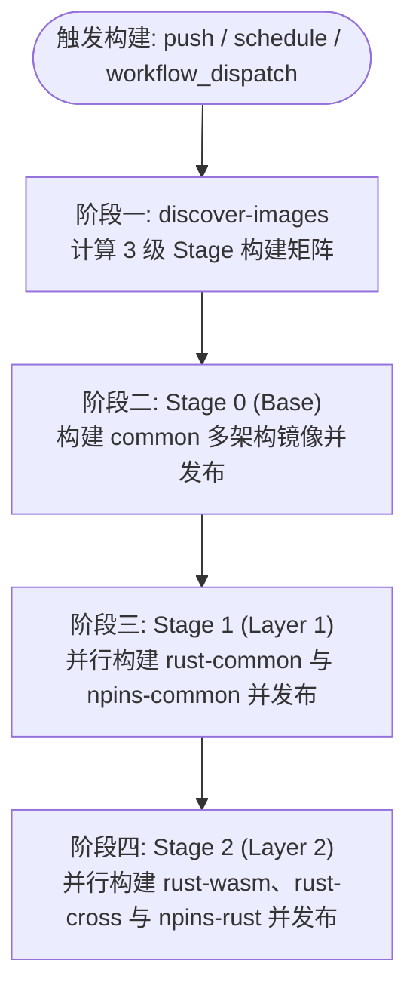

# Coding Images

Coding Images 是一个面向现代化云原生与本地开发的容器镜像仓库。所有镜像均基于 NixOS 与 mise 版本管理器构建，原生支持 `linux/amd64` 与 `linux/arm64` 双架构，采用树状分层继承架构（`common` -> `rust-common` / `npins-common` -> `rust-wasm` / `rust-cross` / `npins-rust`），集成了主流 AI 编程助手 CLI（OpenAI Codex、Claude Code、OpenCode、Antigravity CLI）以及现代语言与工具链，旨在为开发者提供开箱即用、环境一致且极低维护成本的编程工作区。

---

## 目录

- [核心特性](#核心特性)
- [镜像继承拓扑与环境清单](#镜像继承拓扑与环境清单)
  - [继承关系拓扑图](#继承关系拓扑图)
  - [1. common (基础开发环境)](#1-common-基础开发环境)
  - [2. npins-common (Nix/npins 通用环境)](#2-npins-common-nixnpins-通用环境)
  - [3. rust-common (Rust 核心开发环境)](#3-rust-common-rust-核心开发环境)
  - [4. npins-rust (Nix/npins + Rust 环境)](#4-npins-rust-nixnpins--rust-环境)
  - [5. rust-wasm (Rust WebAssembly 环境)](#5-rust-wasm-rust-webassembly-环境)
  - [6. rust-cross (Rust 交叉编译与容器环境)](#6-rust-cross-rust-交叉编译与容器环境)
- [镜像架构与设计机制](#镜像架构与设计机制)
  - [树状分层与 mise conf.d 模块化配置](#树状分层与-mise-confd-模块化配置)
  - [统一智能 Entrypoint 引导流程](#统一智能-entrypoint-引导流程)
  - [容器开发模式与配置持久化](#容器开发模式与配置持久化)
- [快速开始](#快速开始)
  - [使用 Docker 直接运行](#使用-docker-直接运行)
  - [使用 Docker Compose 进行开发](#使用-docker-compose-进行开发)
  - [使用 Dev Containers 进行开发 (VS Code / Cursor / Zed)](#使用-dev-containers-进行开发-vs-code--cursor--zed)
- [本地开发与构建](#本地开发与构建)
  - [镜像目录规范](#镜像目录规范)
  - [镜像自动发现脚本](#镜像自动发现脚本)
  - [本地一键拓扑构建](#本地一键拓扑构建)
- [CI/CD 自动化构建与发布](#cicd-自动化构建与发布)
  - [分阶段 (Staged Matrix) 原生构建流水线](#分阶段-staged-matrix-原生构建流水线)
  - [镜像标签管理策略](#镜像标签管理策略)
  - [工作流触发方式](#工作流触发方式)
- [项目目录结构](#项目目录结构)

---

## 核心特性

- **树状分层继承架构**：镜像之间通过 `FROM` 构建继承链（`common` 作为基底，`rust-common` 继承 `common`，`rust-wasm` 继承 `rust-common`），杜绝重复下载与编译，层级复用率极高。
- **多架构原生构建**：通过 GitHub Actions 分别在 x86_64（`ubuntu-latest`）和 ARM64（`ubuntu-24.04-arm`）运行器上原生编译打包，避免 QEMU 模拟器的性能开销，生成统一的 Multi-Arch 镜像清单。
- **声明式与模块化环境管理**：底层借助 NixOS 基础镜像提供干净可靠的系统级依赖，用户空间通过 `mise` 的系统与全局模块化配置（`/etc/mise/conf.d/`）按层级独立注入 Node.js、Python、Rust、WebAssembly 及各类 CLI 工具。
- **自适应 UID/GID 权限映射**：底层完全承接 NixOS 的自适应 UID/GID 权限映射机制（支持 `HOST_UID:HOST_GID` 环境变量或启动时自动探测挂载的 `/workspace` 工作区属主），使用 `su-exec` 切换至匹配的本地普通用户（默认 `dev`），彻底解决宿主机代码与容器构建产物的权限冲突问题。
- **全自动 direnv 深度集成**：内置 `direnv` 及其 shell hook，配合预置白名单（`/workspace`）与 `use mise` 扩展，容器启动或切换目录时自动加载 `.envrc` / 环境变量，完全免除授权弹窗。
- **内置 AI 编程套件与统一存储**：在基础镜像 `common` 中预装主流终端 AI 编码工具（`@openai/codex`、`claude-code`、`opencode`、`antigravity-cli`），并通过统一数据卷与全局目录映射（`coding-config:/data/coding-config`）自动软链接汇聚 `~/.claude`、`~/.codex`、`~/.gemini` 与 `~/.config/opencode`，实现高内聚的一键凭证备份、迁移与跨镜像共享。
- **标准化 Dev Containers 规范支持**：全量在各层级镜像中预置标准化 `.devcontainer/devcontainer.json` 配置，将安全能力（`cap_add`、`seccomp`）、环境变量及持久化挂载声明为通用工业标准，开箱即用无缝支持 VS Code、Cursor、Zed 等现代容器化 IDE。
- **统一自适应 Entrypoint**：统一的入口引导脚本，自适应支持普通用户（`dev`）与 root 运行模式，不仅自动探测工作区内 9 种层级的 mise 配置文件，还自动初始化与加载 direnv 环境，自动建立 AI 配置软链接，子镜像零维护。
- **完备的构建缓存优化**：Dockerfile 深度集成 BuildKit 缓存挂载（针对 Nix 缓存、mise 工具缓存、Cargo 依赖缓存等），显著加快构建与更新速度。

---

## 镜像继承拓扑与环境清单

所有镜像均发布至 GitHub Container Registry（GHCR）：
`ghcr.io/<owner>/coding-images/<image-name>:<tag>`

### 继承关系拓扑图



---

### 1. common (基础开发环境)

所有编码镜像的基础底座，包含基础开发工具、通用 CLI 与完整的 AI 编程套件。

- **镜像地址**：`ghcr.io/shaogme/coding-images/common:latest`
- **基础镜像**：`ghcr.io/shaogme/nixos-dockers/mise:latest`
- **系统包（Nix）**：`bubblewrap`（沙箱隔离支持）
- **开发语言与运行时（mise）**：Python `latest`
- **AI 辅助工具**：`@openai/codex`、`claude-code`、`opencode`、`antigravity-cli`
- **通用工具**：`direnv`、`jq`、`ripgrep`、`gh`（GitHub CLI）
- **核心组件**：统一智能入口脚本 `/usr/local/bin/mise-entrypoint.sh`、direnv 白名单与 mise 联动配置

### 2. npins-common (Nix/npins 通用环境)

在 `common` 基础上扩展 npins 依赖锁定工具。

- **镜像地址**：`ghcr.io/shaogme/coding-images/npins-common:latest`
- **基础镜像**：`ghcr.io/shaogme/coding-images/common:latest`
- **包含 common 的所有环境**，并额外增加系统包：`nixpkgs.npins`

### 3. rust-common (Rust 核心开发环境)

专为 Rust 核心开发打造的完整环境，集成稳定版与每日构建版编译器及前端辅助工具链。

- **镜像地址**：`ghcr.io/shaogme/coding-images/rust-common:latest`
- **基础镜像**：`ghcr.io/shaogme/coding-images/common:latest`
- **包含 common 的所有环境**，并额外增加：
  - **开发语言与运行时（mise）**：
    - Rust: `stable`（包含 `rust-src` 源码组件）
    - Rust: `nightly`（包含 `rust-src` 源码组件）
    - Node.js: `latest`、pnpm: `latest`、yarn: `latest`
  - **Rust 专属扩展工具**：
    - `cargo-nextest`（Rust 快速测试运行器）
    - `cargo-binstall`（二进制快速安装工具）

### 4. npins-rust (Nix/npins + Rust 环境)

在 `rust-common` 基础上扩展 npins 工具。

- **镜像地址**：`ghcr.io/shaogme/coding-images/npins-rust:latest`
- **基础镜像**：`ghcr.io/shaogme/coding-images/rust-common:latest`
- **包含 rust-common 的所有环境**，并额外增加系统包：`nixpkgs.npins`

### 5. rust-wasm (Rust WebAssembly 环境)

在 `rust-common` 基础上扩展 WebAssembly 交叉编译与 Headless 浏览器测试环境。

- **镜像地址**：`ghcr.io/shaogme/coding-images/rust-wasm:latest`
- **基础镜像**：`ghcr.io/shaogme/coding-images/rust-common:latest`
- **包含 rust-common 的所有环境**，并额外增加：
  - **系统包（Nix）**：`fontconfig`、`dejavu_fonts`、`mesa`、`firefox`、`geckodriver`
  - **Rust 交叉编译 Target**：`wasm32-unknown-unknown`（针对 `stable` 和 `nightly`）
  - **WebAssembly 工具链**：`wasm-pack`、`wasm-bindgen-cli`、`wasmi_cli`
  - **环境配置**：静默 Firefox 企业策略与 Headless 渲染配置

### 6. rust-cross (Rust 交叉编译与容器环境)

在 `rust-common` 基础上扩展 Podman 容器运行时与 Rust 交叉编译套件，原生支持在容器内免后台守护进程执行 `cross` 多架构交叉编译。

- **镜像地址**：`ghcr.io/shaogme/coding-images/rust-cross:latest`
- **基础镜像**：`ghcr.io/shaogme/coding-images/rust-common:latest`
- **包含 rust-common 的所有环境**，并额外增加：
  - **系统包（Nix）**：`podman`、`crun`、`conmon`、`fuse-overlayfs`、`slirp4netns`
  - **交叉编译工具链**：`cross`（官方多目标交叉编译 CLI，基于 `cargo-binstall` 安装）、`cargo-zigbuild`
  - **Docker 命令透明伪装**：内置 `/usr/local/bin/docker` 与 `docker-compose` 包装脚本（透明转发至 Podman）及 `/var/run/docker.sock` 软链接，硬编码 `docker` 命令的各类工具（如 cross 默认逻辑、Makefile 等）无需修改即可直接运行
  - **容器引擎配置**：预置 `/etc/containers/` 存储配置（`fuse-overlayfs` 驱动、`cgroupfs` 管理器）及 `CROSS_CONTAINER_ENGINE=podman` 环境变量
  - **Docker Compose 支持**：提供 `devices: [/dev/fuse]` 与 `podman-containers` 独立命名卷持久化机制

---

## 镜像架构与设计机制

### 树状分层与 mise conf.d 模块化配置



1. **配置模块化**：各镜像通过全局 `/etc/mise/conf.d/` 目录独立注入增量配置：
   - `10-common.toml` -> 由 `common` 注入
   - `20-rust.toml` -> 由 `rust-common` 注入
   - `30-wasm.toml` -> 由 `rust-wasm` 注入（继承并添加 Rust WebAssembly targets）
   - `30-cross.toml` -> 由 `rust-cross` 注入（继承并配置 `cross` 与 Podman 容器引擎）
2. **全局版本锁定（Global Lockfile）**：各镜像在构建时通过 `mise lock --global` 固化当前工具链的确定性版本与 options/targets 元数据，杜绝 `nightly` 跨天版本漂移与 Target 继承丢失。

### 统一智能 Entrypoint 引导流程

所有镜像统一使用 `common` 提供的 `/usr/local/bin/mise-entrypoint.sh`：



### Direnv 深度自动加载机制

1. **零阻断白名单安全机制**：
   镜像默认在系统全局 `/etc/xdg/direnv/direnv.toml` 中将 `/workspace` 添加至 `whitelist.prefix`，开发者在宿主机挂载代码或新建 `.envrc` 时无需手动执行 `direnv allow`，开箱即用。
2. **Direnv 与 Mise 双向原生联动**：
   镜像内置系统级配置 `/etc/xdg/direnv/direnvrc` 包含 `mise direnv activate` 扩展，开发者可在 `.envrc` 中直接写入 `use mise` 享受按需环境切换。
3. **交互与非交互双模态环境变量导出**：
   - **交互式会话**（SSH、`docker exec`、VS Code 终端）：通过系统级 `/etc/bash.bashrc` 中的全局钩子实现 `cd` 目录时自动热切换环境变量。
   - **非交互式/守护进程**（容器启动、后台命令）：Entrypoint 启动时主动通过 `direnv export bash` 将 `.envrc` 环境变量注入至主进程上下文。

### 容器开发模式与配置持久化

各镜像深度整合主流 AI 编程助手（Claude Code、OpenAI Codex、OpenCode、Antigravity CLI）与 direnv 数据持久化。

#### 统一 AI 凭证与存储映射策略

为了避免在 Compose 或容器运行参数中分别声明 `~/.claude`、`~/.codex`、`~/.gemini`、`~/.config/opencode` 等多个分散的命名卷，Coding Images 实施统一的高内聚存储映射策略：

1. **全局统一存储卷**：所有 AI 编程工具的会话状态、认证 Token 与配置文件全部汇聚持久化到单一命名数据卷 `coding-config:/data/coding-config`。
2. **启动自适应软链接**：容器启动时，入口脚本 `mise-entrypoint.sh` 自动在当前工作用户的主目录下创建指向 `/data/coding-config` 子目录的软链接：
   - `${USER_HOME}/.claude` -> `/data/coding-config/claude`
   - `${USER_HOME}/.codex` -> `/data/coding-config/codex`
   - `${USER_HOME}/.gemini` -> `/data/coding-config/gemini`
   - `${USER_HOME}/.config/opencode` -> `/data/coding-config/opencode`
3. **备份与共享内聚**：开发者只需备份、恢复或挂载单个 `coding-config` 数据卷，即可完成全部 AI 助手环境的状态保留与跨容器共享。



> [!TIP]
> **多用户家目录与自适应权限**：
> 默认启动时，容器会自动使用普通开发用户（`dev`，UID/GID `1000:1000`）运行，持久化卷和软链接将根据自适应 UID/GID 自动授权。
> 若需切换为 root 身份运行，只需在启动时传入环境变量：
>
> ```bash
> HOST_UID=0 CONTAINER_HOME=/root docker compose up -d
> ```
>
> 卷与软链接将自动无缝重定向挂载至 `/root`，底层脚本 0 硬编码，所见即所得。

---

## 快速开始

### 使用 Docker 直接运行

以 `rust-wasm` 镜像为例，启动交互式容器：

```bash
docker run -it --rm \
  -e HOST_UID=$(id -u):$(id -g) \
  -v $(pwd):/workspace \
  -v coding-config:/data/coding-config \
  --cap-add=SYS_ADMIN \
  --cap-add=SYS_PTRACE \
  --cap-add=NET_ADMIN \
  ghcr.io/shaogme/coding-images/rust-wasm:latest bash
```

### 使用 Docker Compose 进行开发

以 `images/rust/common` 为例，标准的 `docker-compose.yml` 编排配置如下：

```yaml
services:
  app-base: &app-base
    image: ghcr.io/shaogme/coding-images/rust-common:latest
    environment:
      - ROOT_PASSWORD=root
      - MISE_YES=1
      - HOST_UID=${HOST_UID:-1000:1000} # 自适应宿主机 UID/GID
      - CONTAINER_HOME=${CONTAINER_HOME:-/home/dev} # 默认为 /home/dev，root 模式可覆写为 /root
      - CARGO_INCREMENTAL=1
      - CARGO_TARGET_DIR=/data/.cargo/target
    security_opt:
      - seccomp:unconfined
    cap_add:
      - SYS_ADMIN
      - SYS_PTRACE
      - NET_ADMIN
    tty: true

  dev:
    <<: *app-base
    container_name: rust-common-dev
    volumes:
      # 挂载宿主机源码
      - .:/workspace
      # 独立命名卷隔离 Rust 编译产物
      - rust-target:/data/.cargo/target
      # 持久化 Cargo 依赖与 Git 检出
      - cargo-registry:${CONTAINER_HOME:-/home/dev}/.cargo/registry
      - cargo-git:${CONTAINER_HOME:-/home/dev}/.cargo/git
      # 持久化 direnv 数据
      - direnv-data:${CONTAINER_HOME:-/home/dev}/.local/share/direnv
      # 统一持久化所有 AI 工具配置与会话状态
      - coding-config:/data/coding-config

volumes:
  rust-target:
  cargo-registry:
  cargo-git:
  mise-cache:
  direnv-data:
  coding-config:
```

启动并进入开发环境：

```bash
cd images/rust/common
docker compose up -d dev
docker compose exec dev bash
```

### 使用 Dev Containers 进行开发 (VS Code / Cursor / Zed)

现代 IDE（VS Code、Cursor、Zed、DevPod 等）已广泛支持并原生依赖 [Dev Containers 规范](https://containers.dev)（`.devcontainer/devcontainer.json`）。

Coding Images 为各层级镜像及仓库根目录均内置了对应的标准化 `.devcontainer/devcontainer.json`，把安全能力（`cap_add`）、安全配置（`security_opt`）、环境变量以及持久化挂载统一声明为工业标准规范：

以 `images/rust/wasm/.devcontainer/devcontainer.json` 为例：

```json
{
  "name": "Coding Images - Rust WASM",
  "image": "ghcr.io/shaogme/coding-images/rust-wasm:latest",
  "workspaceFolder": "/workspace",
  "workspaceMount": "source=${localWorkspaceFolder},target=/workspace,type=bind",
  "remoteUser": "dev",
  "capAdd": [
    "SYS_ADMIN",
    "SYS_PTRACE",
    "NET_ADMIN"
  ],
  "securityOpt": [
    "seccomp=unconfined"
  ],
  "containerEnv": {
    "ROOT_PASSWORD": "root",
    "MISE_YES": "1",
    "CARGO_INCREMENTAL": "1",
    "CARGO_TARGET_DIR": "/data/.cargo/target"
  },
  "mounts": [
    "source=rust-target,target=/data/.cargo/target,type=volume",
    "source=cargo-registry,target=/home/dev/.cargo/registry,type=volume",
    "source=cargo-git,target=/home/dev/.cargo/git,type=volume",
    "source=direnv-data,target=/home/dev/.local/share/direnv,type=volume",
    "source=coding-config,target=/data/coding-config,type=volume"
  ],
  "customizations": {
    "vscode": {
      "extensions": [
        "rust-lang.rust-analyzer",
        "tamasfe.even-better-toml",
        "serayuzgur.crates",
        "webassembly.webassembly-studio-extension"
      ],
      "settings": {
        "rust-analyzer.check.command": "clippy"
      }
    }
  }
}
```

#### 使用步骤

1. **VS Code / Cursor**：
   - 打开包含 `.devcontainer` 的目录（例如将对应层级的 `.devcontainer` 复制至自己的工程根目录，或直接打开本仓库）。
   - 按 `F1` 或 `Ctrl+Shift+P`，输入并执行 `Dev Containers: Reopen in Container`。
   - IDE 将自动拉取镜像、挂载统一 `coding-config` 数据卷、加载安全能力并安装预配置插件。
2. **Zed**：
   - 使用 Zed 打开包含 `.devcontainer/devcontainer.json` 的工程目录。
   - 在右下角或命令面板中选择 `Open in Container`，Zed 将解析标准配置并在隔离容器中启动远程开发服务。

---

## 本地开发与构建

### 镜像目录规范

所有镜像均存放在 `images/` 目录下：

```
images/rust/wasm/
├── .config/
│   └── mise.toml         # 该镜像的增量 mise 工具清单 (30-wasm.toml)
├── .devcontainer/
│   └── devcontainer.json # 对应层级的 Dev Container 标准化配置
├── docker/
│   └── Dockerfile        # 镜像构建定义 (FROM coding-images/rust-common)
└── docker-compose.yml    # 本地容器编排配置
```

### 镜像自动发现脚本

```bash
# 查看帮助
python3 scripts/discover_images.py --help

# 以分阶段格式输出
python3 scripts/discover_images.py --format stages

# 以 GitHub Actions 矩阵格式输出
python3 scripts/discover_images.py --format matrix
```

### 本地一键拓扑构建

仓库内置了 `scripts/build_local.sh` 脚本，支持按依赖层级拓扑构建镜像：

```bash
# 构建全部镜像（按 Stage 0 -> Stage 1 -> Stage 2 拓扑构建）
./scripts/build_local.sh all

# 单独构建指定镜像（如 rust-wasm）
./scripts/build_local.sh rust-wasm
```

---

## CI/CD 自动化构建与发布

### 分阶段 (Staged Matrix) 原生构建流水线



1. **Stage 0 (Base)**：构建 `common`，在 x86_64 和 ARM64 上原生构建，合并推送 Multi-Arch Manifest。
2. **Stage 1 (Layer 1)**：并行构建基于 `common` 的 `rust-common` 与 `npins-common`。
3. **Stage 2 (Layer 2)**：并行构建基于 `rust-common` 的 `rust-wasm`、`rust-cross` 与 `npins-rust`。

### 镜像标签管理策略

- `latest`：指向主分支最新构建。
- `<YYYYMMDD>`：按构建日期打标（例如 `20260829`）。
- `sha-<commit_sha>`：关联特定的 Git commit（例如 `sha-a1b2c3d`）。
- `<extra_tag>`（可选）：手动触发时指定的自定义标签。

---

## 项目目录结构

```
.
├── .devcontainer/
│   └── devcontainer.json            # 根工作区 Dev Container 标准化配置
├── .github/
│   └── workflows/
│       ├── build-and-publish.yml    # 3 阶段拓扑编排工作流
│       └── build-single-image.yml   # 跨架构原生构建与 Manifest 合并复用工作流
├── images/
│   ├── common/
│   │   ├── .config/
│   │   │   └── mise.toml            # common 基础与 direnv 工具 (10-common.toml)
│   │   ├── .devcontainer/
│   │   │   └── devcontainer.json    # common Dev Container 配置
│   │   ├── docker/
│   │   │   ├── Dockerfile           # common 构建规则 (FROM nixos-dockers/mise)
│   │   │   └── entrypoint.sh        # 全局统一智能引导脚本 (Mise, Direnv & AI 凭证软链接)
│   │   └── docker-compose.yml
│   ├── npins/
│   │   ├── common/
│   │   │   ├── .devcontainer/
│   │   │   │   └── devcontainer.json # npins-common Dev Container 配置
│   │   │   ├── docker/
│   │   │   │   └── Dockerfile       # npins-common 构建规则 (FROM common)
│   │   │   └── docker-compose.yml
│   │   └── rust/
│   │       ├── .devcontainer/
│   │       │   └── devcontainer.json # npins-rust Dev Container 配置
│   │       ├── docker/
│   │       │   └── Dockerfile       # npins-rust 构建规则 (FROM rust-common)
│   │       └── docker-compose.yml
│   └── rust/
│       ├── common/
│       │   ├── .config/
│       │   │   └── mise.toml        # Rust & Node 增量工具 (20-rust.toml)
│       │   ├── .devcontainer/
│       │   │   └── devcontainer.json # rust-common Dev Container 配置
│       │   ├── docker/
│       │   │   └── Dockerfile       # rust-common 构建规则 (FROM common)
│       │   └── docker-compose.yml
│       ├── cross/
│       │   ├── .config/
│       │   │   └── mise.toml        # 交叉编译工具与 Podman 引擎 (30-cross.toml)
│       │   ├── .devcontainer/
│       │   │   └── devcontainer.json # rust-cross Dev Container 配置
│       │   ├── docker/
│       │   │   └── Dockerfile       # rust-cross 构建规则 (FROM rust-common)
│       │   └── docker-compose.yml
│       └── wasm/
│           ├── .config/
│           │   └── mise.toml        # WASM 增量工具 (30-wasm.toml)
│           ├── .devcontainer/
│           │   └── devcontainer.json # rust-wasm Dev Container 配置
│           ├── docker/
│           │   └── Dockerfile       # rust-wasm 构建规则 (FROM rust-common)
│           └── docker-compose.yml
├── scripts/
│   ├── discover_images.py           # 扫描 images 目录并生成分阶段矩阵的脚本
│   └── build_local.sh               # 本地按依赖拓扑一键构建脚本
├── DIRENV_REFACTORING_PROPOSAL.md   # Direnv 自动加载重构与集成设计规范文档
├── IMAGE_REFACTORING_PROPOSAL.md    # 镜像重构方案设计规范文档
└── README.md                        # 项目主文档
```
