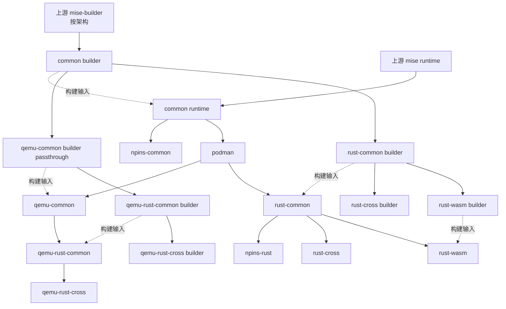

# Mise Runtime / Builder 双轨镜像重构方案

> 本文是双轨构建协议和验收标准。仓库实现已按本文落地；构建与发布仍由 CI 按下述流程执行。

## 1. 背景与目标

当前每个需要预装 Mise 工具的 Dockerfile 都直接从同一个上游
`nixos-dockers/mise-builder` 开始，然后把本级 builder 中的完整工具目录复制到
runtime。子镜像虽然继承了父 runtime，但再次复制时会把父级已经存在的
`/usr/local/share/mise`、Rust toolchain 等内容重新写入自己的层，导致每一级都
可能产生一份累计副本。

重构后的约束如下：

1. 每个有 Mise 工具增量的镜像同时定义两个构建产物：
   - **runtime**：面向用户，继续发布到 GHCR。
   - **mise builder**：只面向后续构建，不发布到 GHCR。
2. builder 沿工具链拓扑继承上一级 builder；只在本级增加工具、lockfile 和缓存。
3. runtime 沿现有运行时拓扑继承上一级 runtime；不从远端重新下载父级工具。
4. runtime 从本级 builder 以 `rsync` 同步受控目录。相同文件不重写，只将相对父
   runtime 的增量写入新层。
5. builder 以每个架构的压缩 Docker archive 在同一次 GitHub Actions workflow 的
   依赖 job 之间传递。builder 镜像不能出现在 GHCR，也不能成为用户可拉取的标签。
6. 允许破坏性调整：单目标构建语义、Dockerfile build args、CI artifact 命名和本地
   构建流程都可以一起切换到新协议。

这里的“按 diff”只表示避免在子 runtime 的新层中重新写入父级已有文件；Docker
镜像仍然保留父 runtime 的历史层，`rsync` 不会把整个镜像展平。

## 2. 目标拓扑

运行时拓扑和 builder 拓扑平行，但二者的父引用是两个独立字段：



`podman`、`qemu-common`、`npins-*` 只增加 Nix 系统包或 npins 工具，没有 Mise
工具增量。它们不需要重新安装 builder；CI 元数据应复用最近的 builder artifact
（或者生成一个无内容的 passthrough target 以保持一对一接口）。默认采用复用，避免
无意义的归档和上传。

各镜像的父关系应显式记录，而不是从单一 `parent` 字段猜测：

| 镜像 | runtime parent | builder parent | builder 行为 |
| --- | --- | --- | --- |
| `common` | 上游 `mise` | 上游 `mise-builder` | 安装 common Mise 工具 |
| `podman` | `common` | `common` builder | 复用 |
| `npins-common` | `common` | `common` builder | 复用 |
| `rust-common` | `podman` | `common` builder | 安装 Rust、Node、Cargo 工具 |
| `qemu-common` | `podman` | `common` builder | 复用 |
| `rust-wasm` | `rust-common` | `rust-common` builder | 增加 wasm targets 和 wasm CLI |
| `rust-cross` | `rust-common` | `rust-common` builder | 增加 cross 工具 |
| `npins-rust` | `rust-common` | `rust-common` builder | 复用 |
| `qemu-rust-common` | `qemu-common` | `qemu-common` builder（内容来自 common builder） | 安装 Rust、Node、Cargo 工具 |
| `qemu-rust-cross` | `qemu-rust-common` | `qemu-rust-common` builder | 增加 cross 工具 |

如果实现选择为 runtime-only 层生成 passthrough builder，则表中的“复用”改为
“从 builder parent 生成无增量的 builder artifact”；不能让这类层从上游全局
`nixos-dockers/mise-builder` 重新开始，否则会失去缓存链。

## 3. Dockerfile 结构

### 3.1 统一的 build args 与 target

所有安装 Mise 工具的 Dockerfile（至少包括 `common`、`rust/common`、`rust/wasm`
和 `qemu/rust/common`，以及同样使用 Mise 的 `rust/cross`、
`qemu/rust/cross`）改成两个显式 target：`mise-builder` 和 `runtime`。

建议使用独立、不会混淆的参数名：

```dockerfile
# syntax=docker/dockerfile:1.7
ARG RUNTIME_PARENT_IMAGE=ghcr.io/shaogme/nixos-dockers/mise:latest
ARG BUILDER_PARENT_IMAGE=ghcr.io/shaogme/nixos-dockers/mise-builder:latest

FROM ${RUNTIME_PARENT_IMAGE} AS runtime-base

FROM ${BUILDER_PARENT_IMAGE} AS mise-builder
# 只复制本级 .config/mise.toml，执行 mise trust/lock/install

FROM runtime-base AS runtime
# 只从 mise-builder 的受控目录 rsync 到 runtime
```

CI 必须显式传入这两个参数。`latest` 只保留给本地开发的默认值；生产构建使用
同一 workflow 生成的架构 tag 或不可变 digest，避免 runtime 和 builder 分别解析到
不同时间的上游内容。

### 3.2 builder target

builder target 的规则：

- `FROM ${BUILDER_PARENT_IMAGE}`，不得再从 runtime parent `COPY` Mise 状态；父级
  builder 已经包含父级工具、lockfile 和缓存。
- 设置与当前 Dockerfile 相同的安装路径：
  `/usr/local/share/mise`、`/data/cache/mise`，Rust 层还包括
  `/usr/local/share/rustup`、`/usr/local/share/cargo` 和
  `/usr/local/share/pnpm`。
- 把本级 `images/*/.config/mise.toml` 写入 `/etc/mise/conf.d/`，然后执行
  `mise trust --all`、`mise lock --global --platform linux-x64,linux-arm64` 和
  `mise install`。
- 只保留构建所需的真实 Bash、Mise 状态和工具缓存，不接收 runtime 的
  `container-init`、`dev-env` 配置、用户 home、临时目录或 secret 文件。
- 继续使用 BuildKit secret 传递 `GITHUB_TOKEN`，命令结束后不得把 token 写入任何
  受控目录。

本级配置仍然是增量配置：

- `images/common/.config/mise.toml` 负责 common 工具；
- `images/rust/common/.config/mise.toml` 负责 Rust/Node/Cargo 工具；
- `images/rust/wasm/.config/mise.toml` 只负责 wasm targets 和 wasm CLI；
- `images/qemu/rust/common/.config/mise.toml` 负责 QEMU 分支的 Rust 工具。

这些 TOML 的工具语义不需要因为双轨构建而重复声明父级工具。锁定和安装只在
builder target 发生，runtime 不应再执行一次全量 `mise install` 来完成镜像构建。

### 3.3 runtime target 与 rsync

runtime target 仍从 runtime parent 开始，并保留现有的 Nix 系统包、
`dev-env.toml`、默认 profile 和权限设置。把当前所有
`COPY --from=mise-tools ...` 替换为 BuildKit bind mount + `rsync`：

```dockerfile
FROM runtime-base AS runtime

# common runtime 安装一次，供所有后代 Dockerfile 在构建时使用。
RUN nix profile add nixpkgs#rsync

RUN --mount=type=bind,from=mise-builder,target=/mnt/mise-builder,ro \
    set -eu; \
    for path in \
        /etc/mise \
        /usr/local/share/mise \
        /data/cache/mise \
        /usr/local/share/rustup \
        /usr/local/share/cargo \
        /usr/local/share/pnpm; do \
        mkdir -p "$path"; \
        rsync -aH --checksum --omit-dir-times \
            "/mnt/mise-builder$path/" "$path/"; \
    done
```

实现时根据镜像层级删去不适用的 Rust 路径。`--checksum` 让 rsync 按内容判断父级
已有文件，`-aH` 保留权限、符号链接和硬链接；不要使用会清理 runtime parent
内容的全局 `--delete`。若未来需要删除旧 toolchain，应单独设计白化/垃圾回收策略，
不能在没有验证的情况下删除父 runtime 的文件。

rsync 的源目录必须是白名单，禁止直接同步 builder 的 `/`、`/usr/local`、`/root`
或完整 Nix profile。这样既避免构建 shell 污染 runtime，也避免将构建凭据和临时
文件带入最终镜像。

`rsync` 可以保留在 common runtime 中作为很小的构建辅助工具；如果后续要求用户
镜像不包含它，应改为单独的临时工具 stage，并明确验证 Nix store closure，而不是在
runtime 中先安装后删除（后者仍会把 store 写入镜像层）。

## 4. GitHub Actions 传递协议

### 4.1 `discover_images.py` 输出

实现后的工作流输出以下元数据：

- `runtime_parent`：父 runtime 镜像名；
- `builder_parent`：最近的父 builder 镜像名或 builder artifact 来源；
- `builder_parent_tag`：当前架构在本地 image store 中使用的完整 builder tag。上游
  根节点使用 `mise-builder`，仓库内 lineage 使用 `<image>-builder`，不能对根节点
  再追加一次 `-builder`；
- `builder_mode`：`mise` 或 `passthrough`；
- `stage`：runtime 拓扑阶段；
- `build_closure`：单目标构建需要包含的 runtime ancestors 和对应 builder ancestors。

当前“指定单个 target 就强制放入 Stage 0”的逻辑必须删除。指定
`rust-wasm` 时至少构建 `common -> podman -> rust-common -> rust-wasm` 的必要闭包；
指定 `qemu-rust-cross` 时构建其完整 QEMU 分支闭包。否则本次 workflow 没有父
builder artifact 可供下载。

### 4.2 每个架构 job 的顺序

`build-single-image.yml` 的 `build-arch` 对 `linux/amd64` 和 `linux/arm64` 分别执行：

每个架构 job 先用 `docker/setup-docker-action` 启用 Docker 的
`containerd-snapshotter`。这样 `docker` driver 既能解析已经 `docker load` 的父级
archive，也能使用 GHA/registry cache exporter；没有 containerd image store 时，
Docker 会拒绝 cache export。

1. 下载同架构的 `builder-${builder_artifact_parent}-${arch}.tar.gz`。根节点没有仓库内父
   artifact 时，直接拉取上游 `mise-builder` 并按当前架构使用。
2. 下载并 `docker load` 父 runtime archive，优先使用本次 workflow 的 artifact；
   只有外部单独构建且没有父 archive 时才从 GHCR 拉取已存在的 runtime tag。
3. 为父 builder 和父 runtime 建立本地架构 tag，例如：
   `local/coding-images/${name}-builder:${arch}` 和
   `local/coding-images/${name}:${arch}`。
4. 使用 `--target mise-builder --output type=docker` 构建本级 builder，输出
   `/tmp/builder-${image}-${arch}.tar`，再压缩为 `.tar.gz`。
5. 使用同一 Dockerfile 的 `--target runtime --output type=docker` 构建 runtime，
   输出 `/tmp/runtime-${image}-${arch}.tar`，再压缩为 `.tar.gz`。
6. 无论 `push` 是否为 `true`，都上传两个 archive 和各自的 SHA-256 sidecar，供
   后继 stage 使用。`push` 只控制 GHCR 发布，不得控制内部 builder artifact 是否
   上传。

builder 与 runtime 使用独立 BuildKit cache scope，例如
`builder-${image}-${arch}` 和 `runtime-${image}-${arch}`。builder 的 registry cache
也不应被当成可发布镜像；如果使用 GHCR `buildcache` 仓库，只存 BuildKit cache
manifest，不创建 `image:builder` 用户标签。

### 4.3 artifact 命名、压缩与保留

建议统一命名：

```text
runtime-<image>-<arch>.tar.gz
runtime-<image>-<arch>.sha256
builder-<image>-<arch>.tar.gz
builder-<image>-<arch>.sha256
```

`actions/upload-artifact` 的 artifact name 应包含 image 和 arch，避免矩阵 job 互相
覆盖；已 gzip 的 archive 交给 artifact action 时关闭二次压缩或设置最低压缩级别。
内部 artifact 保留 1 天即可。下载后先校验 SHA-256，再 `gzip -dc | docker load`。

对于 `podman`、`qemu-common` 和 `npins-*` 这类 `passthrough` 层，子 job 直接下载
`builder_artifact_parent` 的 artifact，不重新打包，也不制造相同内容的 builder 副本。
当 `builder_parent_tag` 与归档来源的 tag 不同（例如 QEMU 分支）时，只建立本地
alias，不重新上传归档。

### 4.4 merge 与发布边界

`merge-and-publish` 只下载和加载 `runtime-<image>-<arch>.tar.gz`：

- 推送 runtime 的架构 tag 和多架构 manifest；
- 继续生成 `latest`、日期、`sha-*` 和手工 extra tag；
- 不执行 `docker push` builder，不为 builder 创建 manifest，不在 README 中提供
  builder 拉取地址；
- builder archive 只存在于当前 workflow 的 artifact 存储中，过期后自动删除。

如果需要避免 stage 之间把半成品 runtime 暴露给用户，可增加内部
`build-${run_id}` tag：所有子镜像从本次 run 的 archive/内部 tag 构建，全部 stage
成功后再由一个 promote job 原子地创建公开 manifest tag。至少在第一次迁移时应使用
不可变的迁移 tag，不能混用旧 runtime 与新 builder 协议。

## 5. 本地构建流程

`scripts/build_local.sh` 必须与 CI 使用同一套 builder 协议：

1. 从根节点开始按拓扑构建；
2. builder target 输出本地 tar archive 并 `docker load`，按 image/arch 建立本地
   builder tag；
3. 子镜像把上一级本地 builder tag 作为 `BUILDER_PARENT_IMAGE`，把上一级 runtime
   tag 作为 `RUNTIME_PARENT_IMAGE`；
4. 最终只给 runtime 打用户镜像 tag，builder tag 仅保留在本地临时构建期间；
5. 单目标同样先构建必要 ancestor closure；builder parent 必须来自对应的本地
   lineage tag，不能绕过父级链回退到全局 builder。

Docker Compose 和开发者使用的公开地址继续指向 runtime 镜像，不应引用 builder。

## 6. 文件级改造清单

以下清单对应本次重构的主要文件边界：

- `.github/workflows/build-and-publish.yml`
  - 将 stage matrix 从单一 runtime 发布改成 runtime + builder artifact 的拓扑编排；
  - 把 `runtime_parent`、`builder_parent`、`builder_mode` 和构建闭包传给 reusable
    workflow；
  - 让下一级 stage 依赖上一级 artifact 完成，而不是只依赖父 runtime manifest；
  - 保留 `push` 作为 GHCR 发布开关，不能用它跳过内部 builder/runtime archive。
- `.github/workflows/build-single-image.yml`
  - 增加父 runtime/builder artifact 下载、SHA 校验、架构 tag 建立和 `docker load`；
  - 分别导出 `--target mise-builder` 与 `--target runtime`；
  - 只在 merge job 推送 runtime，builder archive 只上传为短期 workflow artifact；
  - 拆分 builder/runtime 的 BuildKit cache scope，避免互相污染。
- `images/common/docker/Dockerfile`
  - 引入上游 runtime 和上游 builder 两个父参数；
  - 将 common Mise 安装移动到 `mise-builder` target；
  - 在 runtime 中安装一次 `rsync`，按白名单同步 common 工具目录。
- `images/rust/common/docker/Dockerfile`
  - builder parent 改为 common builder；
  - 删除从 runtime 复制父级 Mise/Rust 目录的逻辑，改为从 builder target 继承并安装
    Rust/Node/Cargo 增量；
  - runtime 只 rsync Mise、Rustup、Cargo 和 pnpm 目录。
- `images/rust/wasm/docker/Dockerfile`
  - builder parent 改为 rust-common builder；
  - wasm targets 和 wasm CLI 只在 wasm builder 中安装；
  - runtime 继续保留 Firefox、字体和 geckodriver 的 Nix 配置，再同步 Mise/Rust
    受控目录。
- `images/qemu/rust/common/docker/Dockerfile`
  - builder parent 沿 qemu 分支的 builder lineage 继承（内容起点为 common builder）；
  - 保留 QEMU runtime parent 和 Rust toolchain 的独立配置；
  - 使用同一 rsync 白名单，不能把 qemu builder 的构建环境带入 runtime。
- `images/common/.config/mise.toml`、`images/rust/common/.config/mise.toml`、
  `images/rust/wasm/.config/mise.toml`、`images/qemu/rust/common/.config/mise.toml`
  - 继续作为本级增量工具声明；
  - 不加入重复的父级工具，也不把 rsync 当作 Mise 工具；
  - 由对应 builder target 写入 `/etc/mise/conf.d/` 并生成继承后的 lock 状态。
- `README.md`
  - 按下一节的内容更新公开架构、示例、发布边界和本地/CI 行为。

实现时还必须同步修改未列出的两个辅助文件：

- `scripts/discover_images.py`：输出双父关系、builder mode，并为单目标返回祖先闭包；
- `scripts/build_local.sh`：构建、加载和传递本地 builder archive/tag。

这两个脚本不改，CI 和本地流程都无法在 builder 不发布的前提下完成下游构建。

## 7. README 与配置说明更新

`README.md` 需要同步重写现有 builder/runtime 描述，重点包括：

- 拓扑图同时展示 runtime parent 和 builder parent；
- 每个镜像条目说明 runtime 会发布、builder 只在 CI artifact 中存在；
- 删除“所有镜像都从同一个上游 `mise-builder` 开始”的表述；
- 将当前 `COPY --from=mise-tools` 示例改成 `--target mise-builder`、
  `--target runtime` 和受控 `rsync` 示例；
- 说明 `latest` 不是 builder tag，用户不应拉取或运行 builder；
- 补充单目标构建会先构建祖先闭包，以及 `push=false` 仍会生成内部 artifacts；
- 记录 runtime/builder 必须使用同一个 NixOS Docker 版本和架构。

四个 `.config/mise.toml` 文件保留为本级增量声明，安装位置和 lock 行为由
Dockerfile 的 builder target 统一处理。不要把 `rsync` 当作 Mise 工具加入这些文件；
它是构建阶段需要的 Nix 系统包，建议在 common runtime 中只安装一次。

## 8. 迁移顺序与兼容策略

这是一次破坏性重构，应按以下顺序合并：

1. 先修改镜像元数据、Dockerfile target 协议、本地构建脚本和 reusable workflow，
   再更新 README；这些文件必须作为一个变更集落地。
2. 用固定的 `NIXOS_DOCKERS_VERSION`（优先不可变版本或 digest）从 `common` 开始
   全量构建到 `qemu-rust-cross`，不要把旧 runtime tag 当作新协议的父层。
3. 第一次生产构建使用不可变迁移 tag 或 `build-${run_id}` 内部 tag，完整拓扑成功
   后再提升为 `latest`。失败时不得让下游继续消费不完整的父链。
4. 验证新 runtime 的所有公开 tag 后，再删除旧的 builder 兼容参数和旧文档描述。
5. 保留旧 runtime 的历史 tag 供回滚，但不保留或发布旧 builder 镜像；builder artifact
   由 workflow retention 自动回收。

## 9. 实现后的验收清单

以下检查用于验收实现：

- 两个架构都能独立导出 builder 和 runtime archive，并能校验、加载；
- `rust-common` 能下载并继承 `common` builder，`rust-wasm` 能继承
  `rust-common` builder；QEMU 分支不会回到全局 builder；
- runtime 的受控目录中 common 文件的 inode 内容和父 runtime 一致，子 runtime 的
  新层只包含本级新增/变更文件；
- builder 中的 `/root`、`/tmp`、`/run/secrets`、真实 Bash shim 和临时 lock 输入
  不会被同步到 runtime；
- GHCR 中只有 runtime 镜像和 BuildKit cache manifest，没有任何 `*-builder` 镜像
  tag；
- `push=false` 的完整拓扑仍可通过 artifact 构建下游镜像；
- 单目标构建自动包含祖先闭包，不依赖本次 workflow 之前存在的 builder；
- 现有 `images/tests/docker.sh` 矩阵仍能验证 entrypoint、Mise、Rust、Podman、QEMU
  和非 root handoff；
- 通过镜像层清单或等效工具确认新方案没有把父级 Mise/Rust 目录逐层完整复制。
